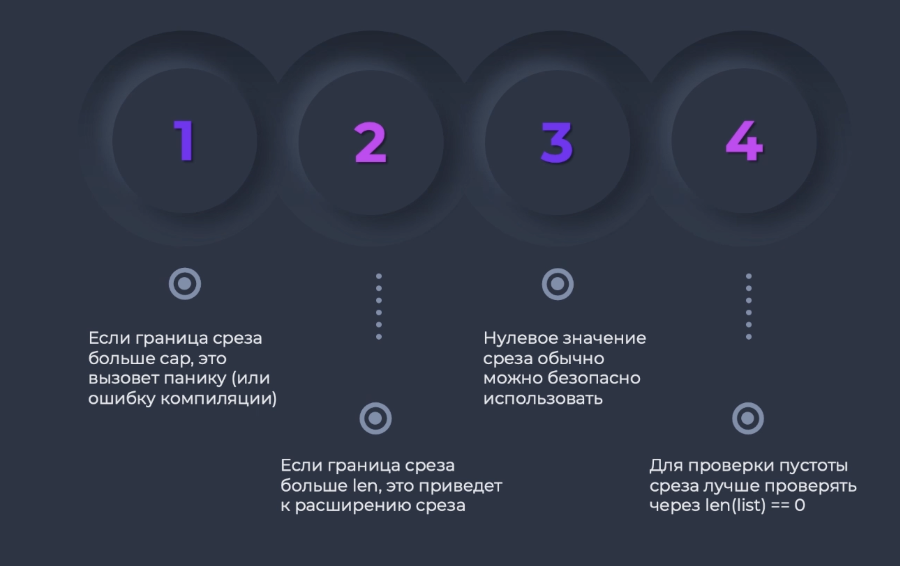
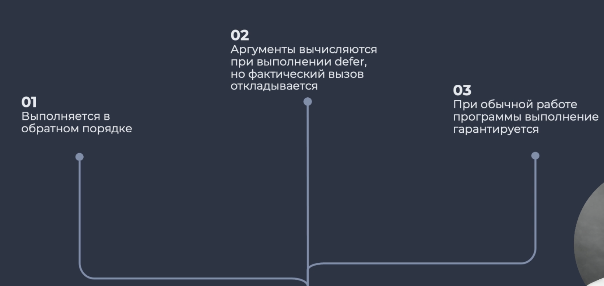

public:: true

- ## Библиотеки
	- #[[math golang]]
	- #[[strconv golang]]
-
- ## Философия [Go]([[Golang]])
	- Быстрая сборка программ(компиляция)
	- Ортогональность - есть один путь решения проблемы
	- Простая грамматика
	- Простая работа с типами
	- Отсутствие неявных преобразований
	- Четкое разделение интерфейса и реализации
	- Сборка мусора
	- Простая параллельность
	- Эффектная система управления пакетами и зависимостями
	- Мало сахара
	- Нет эксепшенов
	- Нет питоновской элегантности
	- Мало операций
	- Поддержка указателей без арифметики над ними
	- Полная поддержка юникод
	- Код очевиден
	- Прост в освоении
	- Очень многое уже написано
-
- ## Что делает [Go]([[Golang]])
	- Высоконагруженные микросервисы
	- Системные утилиты
	- Инфроструктурные утилиты
	- #Kubernetes и другая облачная архитектура
-
- Команды выполнения
	- ```bash
	  // Запуск
	  go run main.go
	  
	  // Форматирование
	  go fmt main.go
	  
	  // Компиляция
	  go main.go
	  
	  // Запуск компилированного файла
	  ./main
	  
	  // Посмотреть версию go
	  go version
	  ```
- Комментарии
	- ```go
	  // Однострочный комментарий
	  
	  /*
	    Блочный
	    комментарий
	  */
	  ```
- Импорт
	- ```go
	  // Импорт одного модуля
	  import "fmt"
	  
	  // Импорт нескольких модулей
	  import (
	    "os"
	    "fmt"
	  )
	  
	  // Импорт rand по пути math
	  import (
	    "fmt"
	    "math/rand"
	  )
	  ```
- Пример минимальной программы
	- ```go
	  // Сообщаем Go о том, что этот файл относится к пакету main
	  package main
	  
	  // Модуль, с основными методами
	  import "fmt"
	  
	  // Обязательная функция
	  func main() {
	    fmt.Println("Hello, Go!") // Вывод чего-то в терминал
	    // >>Hello, Go!
	    fmt.Println("Hello,", "Go!") // Можно несколько парметров
	    // >>Hello, Go!
	  }
	  ```
-
- ```go
  package main
  
  import (
    "math"
    "strings"
  )
  
  func main() {
    math.Floor(2.75) //Округление до целого
    strings.Title("hello!") //Строка с большой буквы
  }
  ```
- ## Типы данных
	- Простые
		- Строки(String)
		  *Неизменяемый тип*
		  *Дефолтное значение - ""*
			- ```go
			  var str string = "Моя строка"
			  str2 := 'Вторая строка'
			  
			  fmt.Println(str[0]) // Вывести байт символа, в не сам символ
			  len(str2) // Количество байт, а не длина строки
			  
			  //Подстроки(срезы, аналогично python)
			  // При получении среза новая память не выделяется
			  str[2:4]
			  str[: 2]
			  ```
			- ```go
			  // Конкатинация строк
			  // Получаеи новую строку
			  str1 + str2
			  
			  // Сравнение строк происходит посимвольно
			  str1 == str2
			  str1 > str2
			  ...
			  ```
		- Булевые значения
			- `true` и `false`
		- Числа
		  *Дефолтное значение - 0*
			- Целые
				- Руны(юникод)
					- Символьный код - `'A'`
					- `type rune = int32`
				- Байты
					- `type byte = uint8`
				- int
					- ```go
					  var num int = 100 // Первый вариант
					  num2 := 100 // Второй вариант
					  
					  var num3, num4 = 1, 3 // Сразу несколько переменных
					  num5, num6 := 1, 3 // Сразу несколько переменных
					  
					  var (
					    num7 = 7
					    str1 = "Строка"
					  )
					  
					  // Игнорирование переменных
					  var (
					    _ = num7
					  )
					  ```
				- int8, int16, int32, int64
				- uint8, uint16, uint32, uint64
			- С плавающей точкой
				- float32
					- *6 знаков после запятой*
					- Маленькая точность. Лучше пользоваться `float64`
				- float64
					- *15 знаков после запятой*
			- Комплексные
				- complex64
				- complex128
		- Ничего
			- ```go
			  nil
			  ```
	- Составные
		- Массив(Array)
		  *Не очень удобно*
			- ```go
			  var x1 [5]int // Массив из 5 int
			  var x2 [2]int = [2]int{1, 3} // [1, 3]
			  var x3 = [3]int{1, 2, 3} // [1, 2, 3]
			  x4 := [4]int{1, 2, 3, 4} // [1, 2, 3, 4]
			  
			  x5 := [...]{1, 2, 3, 4, 5} // [1, 2, 3, 4, 5]
			  
			  len(x5) // Количество элементов в массиве
			  ```
		- Срез(Slice)
		  *Более удобные чем массивы*
			- Последовательность переменной длины
			- ```go
			  var listStr []string
			  
			  var list []int64
			  l := len(list) // 0
			  c := cap(list) // 0
			  
			  list = []int64{1, 2, 3, 4, 5} // [1, 2, 3, 4, 5]
			  l = len(list) // 5
			  c = cap(list) // 5
			  
			  // Новый срез от среза
			  list = make([]int64, 0, 5) // make(type, len, cap) - []
			  l = len(list) // 0
			  c = cap(list) // 5
			  
			  list = make([]int64, 5, 5) // [0, 0, 0, 0, 0]
			  l = len(list) // 5
			  c = cap(list) // 5
			  
			  // Добавление нового элемента в slice
			  list = []int64{1, 2, 3, 4}
			  list = append(list, 5) // [1, 2, 3, 4, 5]
			  
			  l = len(list) // 5
			  c = cap(list) // 8
			  ```
			- Cap(capacity) - емкость среза
			  *Максимальное количество элементов, которое может вместить срез без перевыделения памяти*
				- {:height 329, :width 473}
				- При расширении Slice и больше не остается места cap увеличивается в 2 раза от прошлого cap
		- Отображение(Map)
		  *Все ключи одного типа и все значения одного типа*
			- ```go
			  var m1 map[int32]bool // map[тип ключа]тип значения
			  var m2 map[string]string
			  
			  m3 := make(map[int]int)
			  
			  ages := map[string]int {
			    "Макс": 27,
			    "Андрей": 29
			    // ...
			  }
			  
			  ages["Валера"] = 27
			  fmt.Println(ages["Макс"])
			  ages["Андрей"]++ // Увеличить значение по ключу
			  fmt.Println(ages["Настя"]) // Получими значение по умолчанию, то есть 0
			  
			  ```
		- Структура(Struct)
			- ```go
			  type Point struct {
			    x int
			    y int
			  }
			  
			  
			  // Создать сруктуру типа Point
			  p := Point{
			    x: 4,
			    y: 8
			  }
			  
			  // Краткое создание
			  p = Point{4, 8}
			  
			  fmt.Println(p.x) // 5
			  
			  // Переприсвоение
			  p.x = 89
			  
			  
			  
			  // Структура в структуре
			  type Avatar struct {
			    URL string
			    Size int64
			  }
			  
			  type Client struct {
			    ID int64
			    Name string
			    Age int
			    IMG Avatar
			  }
			  
			  client := Client{} // Поля будут заполнены дефолтными значениями
			  updateNewAvatar(client) // Неправильное обновление
			  updateAvatar(&client) // Правильное обновление
			  
			  func updateNewAvatar(client Client) {
			    // НО!!! обращение произойдет к копии и не заденет сам объект
			    client.IMG.URL = "new url"
			  }
			  
			  func updateAvatar(client *Client) {
			    // Обращение к самому объекту
			    client.IMG.URL = "new url"
			  }
			  ```
- ## Глаголы форматирования
	- *Глагол - часть строки, которая будет заменена значением в определенном формате*
	- |Глагол|Вывод|Пример|
	  |--|--|--|
	  |`%f`|Число с плавающей точкой|`fmt.Printf("A float: %f\n", 3.1415)`|
	  |`%d`|Десятичное целое число|`fmt.Printf("An integer: %d\n", 15)`|
	  |`%s`|Строка|`fmt.Printf("A string: %s\n", "hello")`|
	  |`%t`|Логическое значение(true/false)|`fmt.Printf("A boolean: %t\n", false)`|
	  |`%v`|Произвольное значение (подходящий формат выбирается на основании типа передаваемого значения)|`fmt.Printf("Values: %v %v %v\n", 1.2, "\t", true)`|
	  |`%#v`|Произвольное значение, отформатированное в том виде, в котором оно отображается в коде Go|`fmt.Printf("Values: %#v %#v %#v\n", 1.2, "\t", true)`|
	  |`%T`|Тип передаваемого значения (int, string, ...)|`fmt.Printf("Types: %T %T %T\n", 1.2, "\t", true)`|
	  |`%%`|Знак процента(литерал)|`fmt.Printf("Percent sign: %%\n")`|
- ## Функции и методы
	- ### Стандартные функции
		- Определение типа данных
			- ```go
			  package main
			  
			  import (
			    "fmt"
			    "reflect"
			  )
			  
			  func main() {
			    fmt.Println(reflect.TypeOf(42))
			    fmt.Println(reflect.TypeOf(3.1415))
			    fmt.Println(reflect.TypeOf(true))
			    fmt.Println(reflect.TypeOf("Hello, Go!"))
			  }
			  ```
		- Дата и время
			- ```go
			  package main
			  
			  import (
			    "fmt"
			    "time"
			  )
			  
			  func main() {
			    var now time.Time = time.Now()
			    var year int = now.Year()
			    fmt.Println(year)
			  }
			  ```
		- Replace
			- ```go
			  package main
			  
			  import (
			    "fmt"
			    "strings"
			  )
			  
			  // Меняем # в строке на o
			  func main() {
			    broken := "G# r#cks!"
			    replacer := strings.NewReplacer("#", "o")
			    fixed := replacer.Replace(broken)
			    fmt.Println(fixed)
			  }
			  ```
		- Получение данных от пользователя
			- ```go
			  package main
			  
			  import (
			    "bufio"
			    "fmt"
			    "os"
			  )	
			  
			  func main() {
			    fmt.Print("Введите значение: ")
			    
			    // Создать буферизированное средство чтения текста с клавиатуры
			    reader := bufio.NewReader(os.Stdin)
			    
			    // Возвращает текст, введенный пользователем до нажатия Enter(до /n)
			    // В _(пустой идентификатор) помещается ошибка, но ничему не присваивается
			    input, _ := reader.ReadString('\n')
			    
			    fmt.Println("Введенное значение: ", input)
			  }
			  ```
		- Ошибки
			- С помощью `log`
				- ```go
				  package main
				  
				  import log
				  
				  func main() {
				    log.Fatal("Фатальная ошибка")
				  }
				  ```
			- Создание своего сообщения об ошибки с помощью `errors`
				- ```go
				  package main
				  
				  import (
				    "errors"
				    "log"
				    "fmt"
				  )
				  
				  func main() {
				    err := errors.New("Мое сообщение об ошибки")
				    fmt.Println(err.Error())
				    log.Fatal(err)
				  }
				  ```
			- Форматируем сообщение об ошибке
				- ```go
				  package main
				  
				  import (
				    "errors"
				    "log"
				    "fmt"
				  )
				  
				  func main() {
				    err := fmt.Errorf("a height of %0.2f is invalid", -2.33333)
				    fmt.Println(err.Error()) // Вариант вывода 1
				    fmt.Println(err) // Вариант вывода 2
				  }
				  ```
			- Возврат ошибки из функции
				- ```go
				  func testErrors() (int, error) {
				    return 1, nil
				  }
				  ```
		- Получить размер файла
			- ```go
			  package main
			  
			  import (
			    "fmt"
			    "log"
			    "os"
			  )
			  
			  func main() {
			    fileInfo, err := os.Stat("myFile.txt")
			    if err != nil {
			      log.Fatal("Критическая ошибка: ", err)
			    } else {
			      fmt.Println("Размер файла myFile.txt: ", string(fileInfo.Size()))
			    }
			  }
			  ```
		- Удалить лишние символы в строке
			- ```go
			  s := "\t Моя строка \n"
			  strings.TrimSpace(s)
			  ```
		- Красивый вывод `float`
			- ```go
			  fmt.printf("Вывод числа с двумя знаками после точки: %0.2f\n", 1.0/3.0)
			  
			  // Не вывод а возврат строки
			  resultString = fmt.Sprintf("Возврат числа с двумя знаками после точки: %0.2f", 1.0/3.0)
			  fmt.println(resultString)
			  ```
			- `%0.2f` является глаголом означающем количество знаков после точки
			- 
	- При выполнении операций типы должны быть одинаковые
		- `int` умножить на `float` не получится
	- Преобразовать тип
		- `float64(varInt)`
		- `int(varFloat)`
		- Из строки в Float
		  ```go
		  import (
		    "strconv"
		    "strings"
		  )
		  
		  myStringFloat := "2.45"
		  myStringFloat = strings.TrimSpace(myStringFloat)
		  myFloat, err := strconv.ParseFloat(myStringFloat, 64) //64 количество битов
		  ```
		- Из строки в Int
		  ```go
		  import "strconv"
		  
		  myStringInt := "1000"
		  myInt, err := strconv.Atoi(myStringInt)
		  ```
	-
- ## Выражения
	- ```go
	  // Увеличить значение переменной
	  x = x + 1
	  x += 1
	  x++
	  
	  // Уменьшить значение переменной
	  y := y - 1
	  y -= 1
	  y--
	  ```
- ## Переменные
	- Объявление переменных
	  *Переменные должны быть в lowerCase*
	  ```go
	  var varName int
	  varName = 14
	  
	  //Объявление и присвоение в одной строке
	  var varInt int = 4
	  var varInt2 = 5
	  varTest := 56
	  
	  //Несколько переменных
	  var float1, float2 float64
	  
	  //Присвоение нескольких переменных
	  float1, float2 = 1.4, 3.14
	  ```
	- ```go
	  var varName int
	  varName = 14
	  
	  //Объявление и присвоение в одной строке
	  var varInt int = 4
	  var varInt2 = 5
	  varTest := 56
	  
	  //Несколько переменных
	  var float1, float2 float64
	  
	  //Присвоение нескольких переменных
	  float1, float2 = 1.4, 3.14
	  ```
	- Название переменных
		- Используется lowerCase
		- CamlCase используется если переменная будет экспортироваться из пакета
	- Константы
		- *Константа объявляется за пределами любых функций*
		- *Константа названная с большой буквы - импортируется*
		- ```go
		  package main
		  
		  const myConst int = 3
		  
		  func main() {
		    ...
		  }
		  ```
		-
- ## Условные операторы
	- if -  else
		- ```go
		  if varInt < 2 {
		    fmt.Println("varInt меньше 2")
		  } else if varInt > 2 {
		    fmt.Println("varInt больше 2")
		  } else {
		    fmt.Println("varInt равен 2")
		  }
		  ```
		- Если нужно отрицание - используем `!`
		  ```go
		  if !false {
		    fmt.Println(true)
		  }
		  ```
		- И / ИЛИ
		  ```go
		  if true && true {
		    fmt.Println("Логическое И")
		  }
		  
		  if true || true {
		    fmt.Println("Логическое ИЛИ")
		  }
		  ```
	- Swith Case
		- ```go
		  switch a {
		    case 1:
		    	// Блок 1
		    default:
		    	// Дефолтный блок
		  }
		  
		  switch {
		    case a > 1 || b < 10:
		    	// Болок 1
		    case a == 0:
		    	// Блок 2
		    default:
		    	// Дефолтный блок
		  }
		  ```
- ## Циклы
	- for
		- ```go
		  for 'инициализация переменных'; 'условие'; 'изменение переменной' {
		    'тело блока цикла'
		  }
		  
		  for {
		    // Бесконечный цикл
		  }
		  
		  for a == 5 {
		    // Цикл с условием
		  }
		  
		  
		  for x := 0; x <= 6; x++ {
		    fmt.Println(x)
		    // Цикл с пораметром
		  }
		  ```
		- Range
			- ```go
			  // Перебор слайса
			  sl := []int64{9, 8, 7}
			  for key, value := range sl { // В данном случае ключ - индекс
			    fmt.Printf("key: %v, val: %v \n", key, value)
			  }
			  
			  // Без ключа
			  for _, value := range sl { // В данном случае ключ - индекс
			    fmt.Println(value)
			  }
			  
			  // Цикл по мапе
			  ages := map[string]int {
			    "Макс": 27,
			    "Андрей": 29
			  }
			  for name, age := range ages {
			    fmt.Printf("Имя: %v, Возраст: %v", name, age)
			  }
			  
			  // Со строками аналогично, но получим не символ, а байтовое представление
			  
			  ```
		- Можно несколько параметров опустить
			- ```go
			  x := 0
			  for x <= 100 {
			    x++
			  }
			  ```
	- Остановка цикла
		- `break` - остановить выполнение цикла
		- `continue` - остановить итерацию цикла
- ## Функции
	- Пример простейшей функции
		- ```go
		  func myFuncName() {
		    fmt.Println("Print в теле функции")
		  }
		  ```
	- Функция с аргументами
		- ```go
		  func printSum(x int, y int) {
		    fmt.Println(x + y)
		  }
		  ```
	- Функция с возвращаемым значением
		- ```go
		  func mySum(x int, y int) int {
		    return x + y
		  }
		  ```
	- Функция, которая возвращает несколько значений
		- ```go
		  func manyReturns() (int, bool, string) {
		    return 1, true, "String"
		  }
		  ```
		- Именованные возвращаемые значения
			- ```go
			  // Функция отделяет целую часть от дробной
			  
			  func floatParts(number float64) (integerPart int, fractionalPart float64) {
			    wholeNumber := math.Floor(number)
			    return int(wholeNumber), number - wholeNumber
			  }
			  
			  // Пустой return в именованых возвращаемых значениях вернет эти хначения
			  func test1() {x int, y int} {
			    x := 1
			    y := 2
			    return
			  }
			  
			  fmt.Println(test1()) // 1, 2
			  
			  
			  // Именованные возвращаемые параметры имеют значения по умолчанию
			  func test2() {x int, y int} {
			    return x, y
			  }
			  
			  fmt.Println(test2()) // 0, 0
			  ```
	- Рекурсия
	  *Функция вызывает сама себя*
		- ```go
		  // Рекурсивный факториал
		  func factorial(n int) int {
		    if n <= 0 {
		      return 1
		    }
		    return factorial(n-1) * n 
		  }
		  ```
	- Анонимные функции
		- ```go
		  f := func () {...}
		  
		  s := string Map(func(r rune) rune {return r + 1}, "SDWS")
		  
		  fmt.Println(s)
		  ```
	- Функции как тип данных
		- ```go
		  var f, f2 func(s string) int
		  f = func(s string) int {return len(s)}
		  f2 = func() int {return 1} // ОШИБКА КОМПИЛЯЦИИ!
		  ```
	- Замыкание
	  *Функция использует переменные, которые объявлены вне этой функции*
		- ```go
		  func adder() func(int) int {
		    sum := 0
		    return func(x int) int {
		      sum += x
		      return sum
		    }
		  }
		  ```
	- Отложенный вызов функций
	  {:height 235, :width 590}
		- ```go
		  func main() {
		    f := createFile("/tmp/defer.txt")
		    defer closeFile(f)
		    writeFile(f)
		  }
		  ```
		- ```go
		  package main
		  
		  import "fmt"
		  
		  func end() {
		    fmt.Println("Конец")
		  }
		  
		  func main() {
		    defer end()
		    num := 5
		    
		    defer func(x int) {
		      fmt.Println(x)
		    }(num)
		    
		    num = 20
		  }
		  
		  // defer выполнится в самом конце
		  // Если defer несколько - они выполнятся в обратном порядке
		  // >> 5
		  // >> Конец
		  ```
		-
- ## Указатели
	- Вывод указателя переменной
		- ```go
		  fmt.Println(&myVar)
		  ```
	- Создание указателя через `new`
		- ```go
		  i := new(int64) // Создали указатель с типом int64 на память без значения
		  ```
	- Получить тип указателя в памяти
		- ```go
		  package main
		  
		  import (
		    "fmt"
		    "reflect"
		  )
		  
		  func main() {
		    var myInt int
		    fmt.Println(reflect.TypeOf(&myInt))
		    var myFloat float64
		    fmt.Println(reflect.TypeOf(&myFloat))
		    var myBool bool
		    fmt.Println(reflect.TypeOf(&myBool))
		  }
		  ```
	- Сохранить указатель в переменную
		- ```go
		  var myInt int
		  var myIntPointer *int
		  myIntPointer = &myInt
		  fmt.Println(myIntPointer)
		  ```
	- Чтение значения по указателю
		- ```go
		  myInt := 4
		  myIntPointer := &myInt
		  fmt.Println(*myIntPointer)
		  ```
	- Запись значения по указателю
		- ```go
		  myInt := 4
		  myIntPointer := &myInt
		  *myIntpointer = 8
		  fmt.Println(myInt) // << 8
		  ```
	- Возвращение указателя функцией
		- ```go
		  func careatePointer() *float64 {
		    var myFloat = 98.5
		    return &myFloat
		  }
		  
		  func main {
		    var myFloatPointer *float64 = createPointer()
		    fmt.Println(*myPointer)
		  }
		  ```
	- Возвращение значения по указателю
		- ```go
		  func getValueInPointer(myPointer *bool) bool {
		    return *myPointer
		  }
		  
		  func main() {
		    myBoolVar := true
		    fmt.Println(getValueInPointer(&myBoolVar))
		  }
		  ```
- # Пакеты
	- *Хранение кода в отдельный файлах*
	- Правила создания пакетов
		- Имя пакета должно быть записано только символами нижнего регистра
		- Имя следует сокращать, если его смысл очевиден (например, fmt)
		- По возможности имя должно состоять из одного слова. Если необходимы два слова, они
		  не должны разделяться символами подчеркивания, а второе слово не должно начинаться с буквы верхнего регистра (пример — пакет strconv).
		- Импортированные имена пакетов могут конфликтовать с именами локальных перемен-
		  ных, поэтому не используйте имя, которое с большой вероятностью может быть выбрано
		  пользователями пакета. (Например, если бы пакет fmt назывался format, то импорт этого
		  пакета создавал бы риск конфликта с локальной переменной format.)
		- При обращении к функции или переменной, определенной
		  в текущем пакете, не следует уточнять имя пакета
	- `Рабочая область` - директория, в которой лежит код пакетов
	- По умолчанию `рабочая область` находится в `~/go`
		- Иногда она создана в `/usr/local/go`
	- Структура каталога `go`
		- go [[$green]]==*// Каталог рабочей области*==
			- bin [[$green]]==*// Исполняемые программы*==
			- pkg [[$green]]==*// Откомпилированный код пакетов*==
			- src [[$green]]==*// Исходный код*==
				- doodad [[$green]]==*// Код пакета `doodad`*==
				- gizmo [[$green]]==*// Код пакета `gizmo`*==
					- gizmo.go
					- plug.go
	- Пример создания пакета `greeting`
		- [[$red]]==*Пакет нужно называть с маленькой буквы, а функции с большой*==
		- Создаем директорию с файлом `~/go/src/greeting.go`
		- Добавляем код
			- ```go
			  // Указываем имя пакета
			  package greeting
			  
			  // Нужные импорты
			  import "fmt"
			  
			  /*
			  	Функции пакета начиаются с большой буквы 
			  	так как будут импортированы
			  */
			  func Hello() {
			    fmt.Println("Hello!")
			  }
			  
			  func Hi() {
			    fmt.Println("Hi!")
			  }
			  ```
		- Импорт происходит по названию пакета
			- Создадим новый пакет `~/go/hi/main.go` с кодом
				- ```go
				  package main
				  
				  import "greeting"
				  
				  func main() {
				    greeting.Hi()
				    greeting.Hello()
				  }
				  ```
			- Теперь можно использовать `init`
				- Выполня§ем `go install hi`
				- В директории `~/go/bin` появится исполняемый файл `hi`
				- Теперь можно просто его запускать
					- ```bash
					  hi
					  ```
				-
				-
	- Подкаталоги пакетов
		- Например, в каталоге `greeting` лежит каталог `test`
		- ```go
		  import "greeting/test"
		  ```
	- Современный вариант создания `Рабочей области` в `Go`
		- Инициализация
			- ```bash
			  go mod init my_project
			  ```
		- После чего в нашем проекте появится файл `go.mod`
		- Далее следует создавать пакеты прямо в нашем проекте `my_project/package_name`
		- И импортировать так же `"my_project/package_name"`
	- Смена рабочей области
		- *Можно поменять адрес рабочей области с помощью переменной окружения `GOPATH`*
		- ```bash
		  // Меняем на '/code'
		  export GOPATH="/code"
		  ```
- ## Тесты
	- Ручное тестирование
	  *Просто тыкаем руками*
		- Минусы
			- Можно ошибиться
			- Долго
			- Нет возможности моделировать нагрузку
			- Сложности в повторном использовании
	- Автотесты
		- Минусы
			- Стоимость
		- Плюсы
			- Все, что было минусом в ручном
	- Пирамида тестирования
		- Снизу вверх возрастает сложность и цена тестирования
		- {:height 529, :width 439}
		- Модульные тесты
		  logseq.order-list-type:: number
		  *Проверка частей нашего кода (методы, функции, структуры и тд)*
			- Пример - тестируем отдельную
		- Интеграционные тесты
		  logseq.order-list-type:: number
			- Пример - запрос в базу данных
		- Компанентные
		  logseq.order-list-type:: number
		  *Проверяют функционал нашего сервиса. Являются критериями приемки*
			- Пример - проверяем, что сервис делает то, что должен делать (ПСИ в Сбере)
		- Сквозные
		  logseq.order-list-type:: number
		  *Тестируем все приложение и взаимодействие сервисов внутри него*
	- Пример теста
		- Создаем файл который тестирум - `fib.go`
			- ```go
			  package main
			  
			  func fib(n uint) uint {
			    if n == 0 {
			      return 0
			    } else if n == 1 {
			      return 1
			    } else {
			      return fib(n-1) + fib(n-2)
			    }
			  }
			  ```
		- Рядом создаем файл `fib_test.go`
		  *Go автоматически посчитает файл с припиской `_test` как тест*
			- ```go
			  package main
			  
			  import "testing"
			  
			  func TestFibZero(t *testing.T) {
			    res := fib(0)
			    if res != 0 {
			      t.Fatal("Неправильная реакция на 0")
			    }
			  }
			  
			  func TestFibOne(t *testing.T) {
			    res := fib(1)
			    if res != 1 {
			      t.Fatal("Неправильная реакция на 1")
			  }
			  
			  func TestFibNum(t *testing.T) {
			    res := fib(3)
			    if res != 2 {
			      t.Fatal("Неправильная реакция на число больше 1")
			    }
			  }
			  ```
	- Чтобы проверить какой процент кода покрыт тестами нужно запустить команду в [терминале]([[Терминал]])
		- ```bash
		  go test -cover
		  ```
	- Показать код, который покрыть тестами
		- ```bash
		  go test -coverpofile=cover.out // Название файла куда сохраним результат
		  
		  go tool cover -html=cover.out -o cover.html // На основе cover.out создать html файл с более развернутой информацией
		  ```
		-