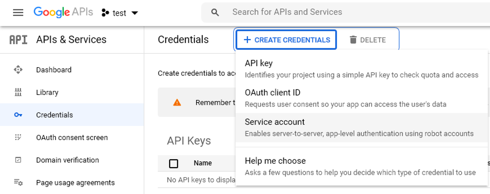

public:: true
logseq.order-list-type:: number

- Перейдите на [Google Developer Console](https://console.developers.google.com/)
  logseq.order-list-type:: number
- Нажмите Select a project
  logseq.order-list-type:: number
  
- Нажмите NEW PROJECT
  logseq.order-list-type:: number
  
- Введите имя и нажмите Create
  logseq.order-list-type:: number
  
- Нажмите Enable Apps and Services
  logseq.order-list-type:: number
  
- Выберите из предложенных Google Drive API и Google Sheets API (они находятся ниже в списке) и для каждого из них…
  logseq.order-list-type:: number
  
  ... нажмите ENABLE (нужно для их подключения)
  
  Для выбора следующего API, выберите Google APIs слева, а затем перейти в Library (или просто нажмите в браузере на стрелку назад).
  
- Снова нажмите Google APIs слева и перейдите во вкладку Credentials
  logseq.order-list-type:: number
  
- Нажмите Create credentials и выберите Service account
  logseq.order-list-type:: number
  
- Введите имя и нажмите CREATE
  logseq.order-list-type:: number
  
- Выберите роль Owner и нажмите Continue
  logseq.order-list-type:: number
  
- Нажмите DONE
  logseq.order-list-type:: number
  
- Нажмите на ссылку с названием почты, для которой создаётся ключ. На скрине она в разделе Service Accounts, ссылка фиолетового цвета
  logseq.order-list-type:: number
  
- Выберите вкладку Keys и нажмите ADD KEY → Create new key
  logseq.order-list-type:: number
  
- Выберите json и нажмите CREATE
  logseq.order-list-type:: number
  
- Сохраните созданный json файл
  logseq.order-list-type:: number
  
- Откройте файл ключа в текстовом просмотрщике и скопируйте почту в разделе client_email (это действие можно выполнить через библиотеку json из питона)
  logseq.order-list-type:: number
  
- Для проверки, что всё работает, откройте какую-нибудь таблицу в Google Docs, выберите настройки доступа, введите скопированную почту в поле и нажмите **готово**.
  logseq.order-list-type:: number
- Код в python
  logseq.order-list-type:: number
  ```python
  import gspread
  from oauth2client.service_account import ServiceAccountCredentials
  
  
  # Specify path to your file with credentials
  path_to_credential = 'credentials.json' 
  
  # Specify name of table in google sheets
  table_name = 'name of your table'
  
  scope = ['https://spreadsheets.google.com/feeds',
           'https://www.googleapis.com/auth/drive']
  
  credentials = ServiceAccountCredentials.from_json_keyfile_name(path_to_credential, scope)
  
  gs = gspread.authorize(credentials)
  work_sheet = gs.open(table_name)
  
  # Select 1st sheet
  sheet1 = work_sheet.sheet1
  
  # Get data in python lists format
  data = sheet1.get_all_values()
  
  # Get header from data
  headers = data.pop(0)
  
  # Create df
  df = pd.DataFrame(data, columns=headers)
  df.head()
  ```
- НЕ ЗАБЫВАЕМ ПЕРЕВЕСТИ НАШЕ ПРИЛОЖЕНИЕ С ТЕСТА НА ПРОМ(иначе токен с ключом умрут через какое-то время)
  logseq.order-list-type:: number
-
- # **Работа с гугл документами**
- ### Подготовка
  
  ```python
  import pandas as pd
  import gspread
  from df2gspread import df2gspread as d2g
  from oauth2client.service_account import ServiceAccountCredentials
  
  scope = ['<https://spreadsheets.google.com/feeds>',
         '<https://www.googleapis.com/auth/drive>']
  
  my_mail = 'your@mail'
  path_to_credentials = 'crdentials.json'
  
  # Authorization
  credentials = ServiceAccountCredentials.from_json_keyfile_name(path_to_credentials, scope)
  gs = gspread.authorize(credentials)
  ```
-
- ### **Загрузка таблицы из гугл доков**
  
  ```python
  # Name of the table in google sheets,
  # can be url for open_by_url
  # or id (key) part for open_by_key
  table_name = 'table name'  # Your table
  
  # Get this table
  work_sheet = gs.open(table_name)
  
  # Select 1st sheet
  sheet1 = work_sheet.sheet1
  
  # Get data in python lists format
  data = sheet1.get_all_values()
  
  # Get header from data
  headers = data.pop(0)
  
  # Create df
  df = pd.DataFrame(data, columns=headers)
  df.head()
  ```
  
  При считывании таблицы должен быть доступ к ней, например, при считывании по ссылке (url) с помощью функции `open_by_url` нужно настроить права доступа на данную таблицу.
-
- ### **Создание своей таблицы**
  
  ```python
  # Create empty table
  table_name = 'A new spreadsheet'
  sheet = gs.create(table_name)
  
  # Make it visible to other guys
  sheet.share(my_mail, perm_type='user', role='writer')
  ```
  
  [Документация](https://gspread.readthedocs.io/en/latest/)
-
- ### **Экспорт датафрэйма в гугл доки**
  
  Для переноса датафрэйма в таблицу гуглдока, нужно, чтобы вы сделали эту таблицу из питона. Поэтому прогоните перед этой частью предыдущий раздел с желаемым названием таблицы:
  
  ```python
  # Create your df
  df = ...
  
  # Looks like spreadsheet should be already present at the dist (so, run code in create table section)
  sheet_name = 'Master'
  d2g.upload(df, table_name, sheet_name, credentials=credentials, row_names=True)
  ```
  
  При этом необходимо, чтобы в `df` не было повторяющихся индексов (`reset_index`)
  
  [Документация](https://df2gspread.readthedocs.io/en/latest/examples.html)
  
  Чтобы получить ссылку на гугл документ, воспользуйтесь следующим кодом
  
  ```python
  spreadsheet_url = "<https://docs.google.com/spreadsheets/d/%s>" % sheet.id
  ```
  
  где `sheet` — результат `gs.create(table_name)`