public:: true

- ## История Hadoop
- 2003 - Google File System paper
- 2004 - MapReduce paper
- 2006 - Hadoop project
- 2008 - Pig, Hive, HBase
- 2008 - Создание Cloudera
- 2009 - Amazon EMR
- 2011 - Выделение Hortonworks
- 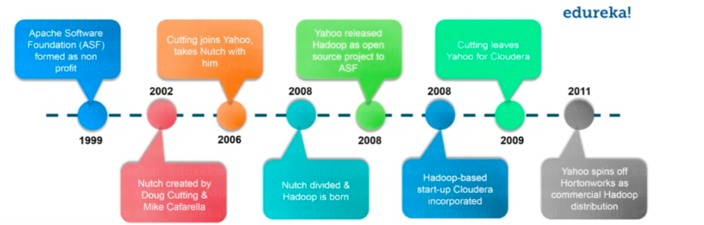
- **Под словом hadoop могут подразумеваться**
- Несколько сервисов, составляющих “Ядро” Hadoop
- Вся экосистема сервисов Hadoop
- Кластер под управлением Hadoop
  
  **Предпосылки появления Hadoop**
- Потребность в распределенных хранилищах
- Масштабирование вычислений
- Управление ресурсами
- ## DataLake
  
  `ETL` - достали данные, разобрали, положили в хранилище
  
  `DataLake` - загружаем все в том виде, что есть а потом достаем, что нужно по мере надобности
- 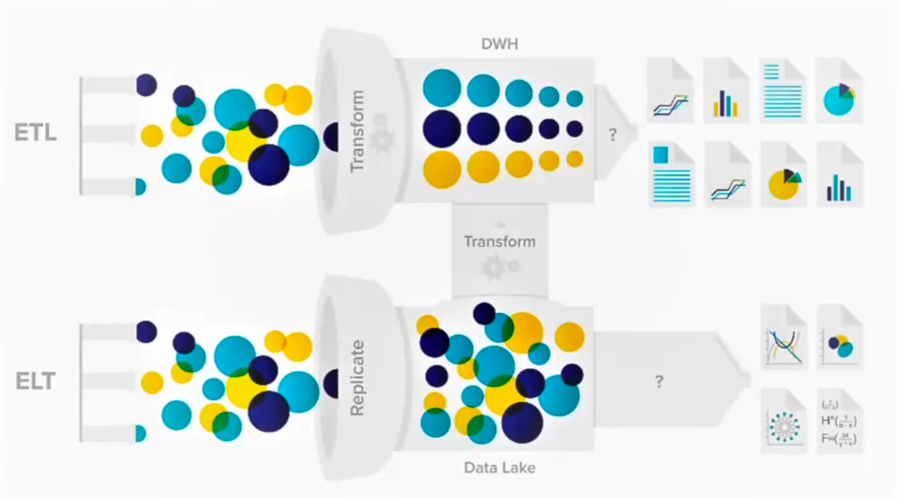
- # Экосистема Hadoop
- 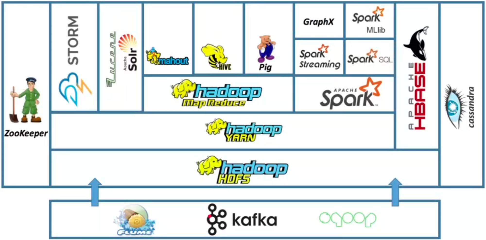
- # Zookeeper
  
  Централизованная служба для поддержки информации о конфигурации, именования, обеспечения распределенной синхронизации и предоставления групповых служб.
  
  Не хранит сами данные
  
  Пример хранения информации в `zookeeper`
- 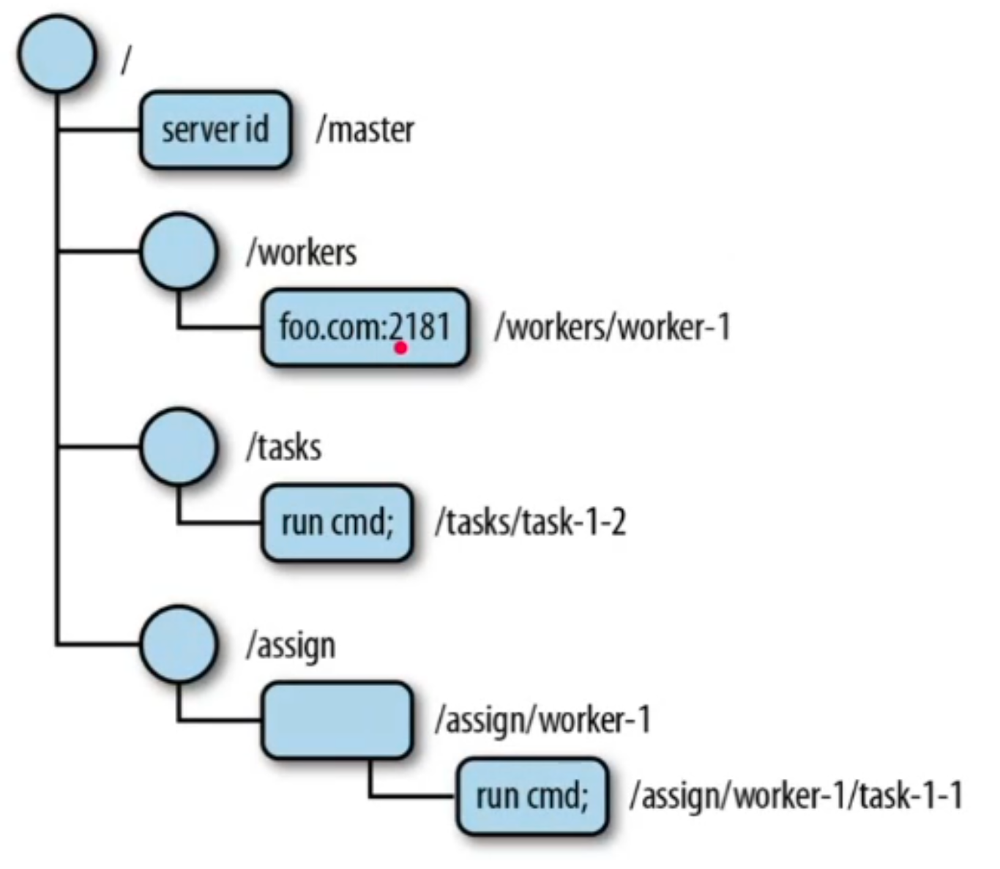
- `Zookeeper` тоже распределенная система
- 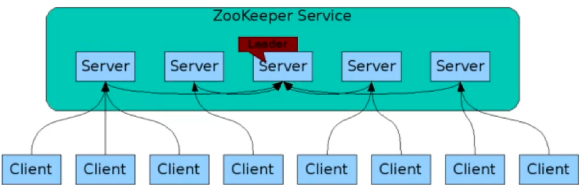 
  
  
  При отказе #Leader сервера, выбирается новый #Leader путем голосования
  
  [Пример голосования RAFT](https://raft.github.io/) - ВАЖНО! в zookeeper не используется RAFT
- # HDFS
  
  Hadoop Distributed File System - Файловая система, предназначенная для хранения файлов больших размеров, поблочно распределенных между узлами вычислительного кластера.
- ## Архитектура  `HDFS`
- 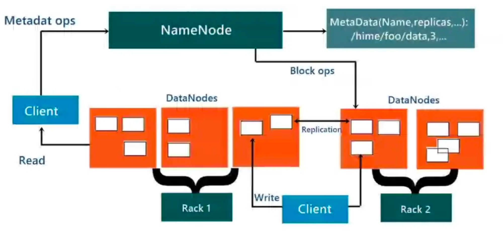
- `NameNode` - Хранит мета информацию блок ↔ файл
- Отказоустойчивость NameNode(High-Availability)
- 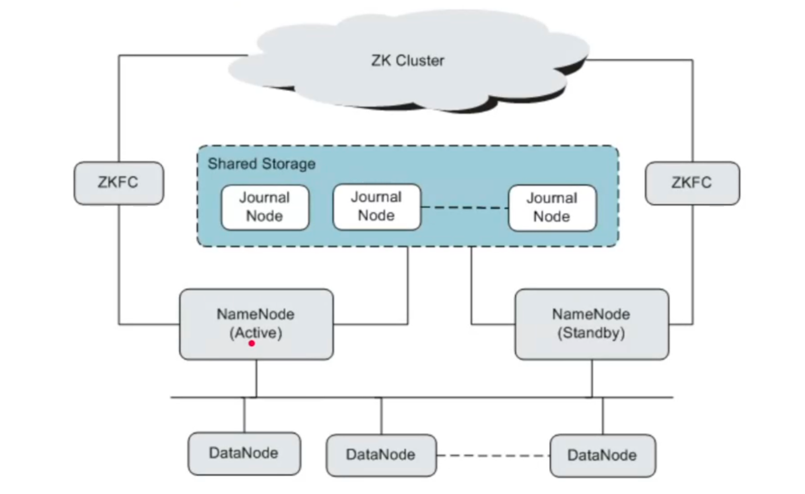
- `DataNode` - Хранит блоки
  `Secondary Namenode` - хранит слепок NameNode
- 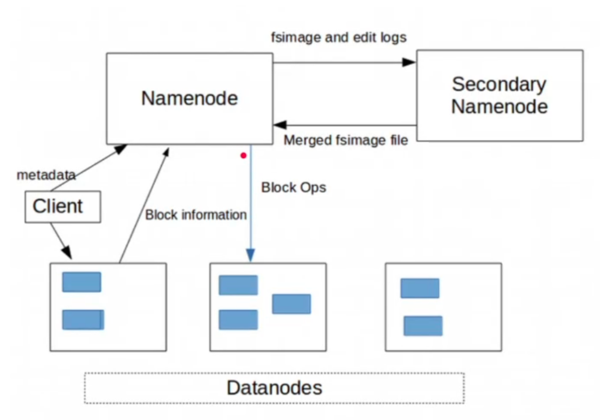
- ### Файлы и блоки
  
  Файл - запись в метаданных
  
  Содержимое файла хранится в нескольких блоках одинакового размера
- 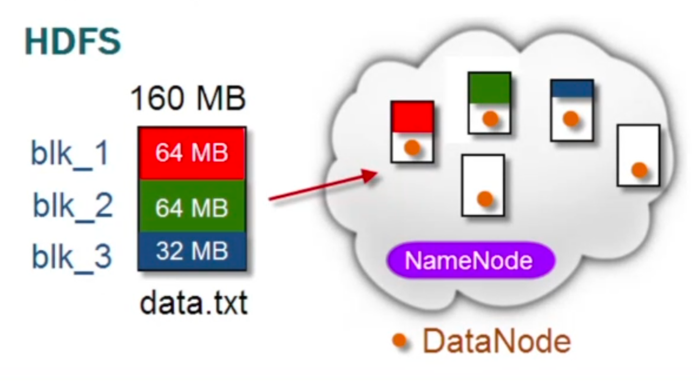
- ### Репликация
- 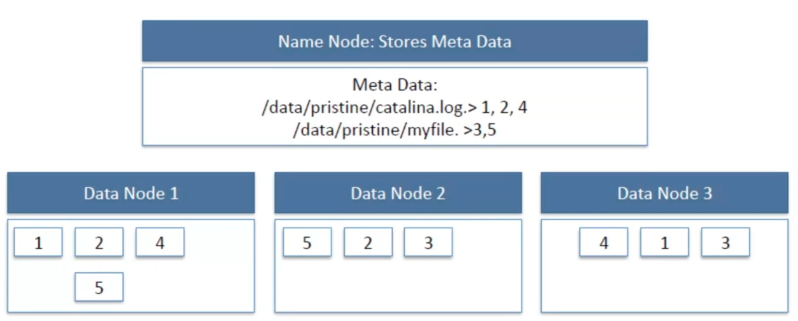
-
- ### Чтение файлов
- Клиент запрашивает у nameNode реплики блоков
- Чтение непосредственно с ближайшей реплики
- 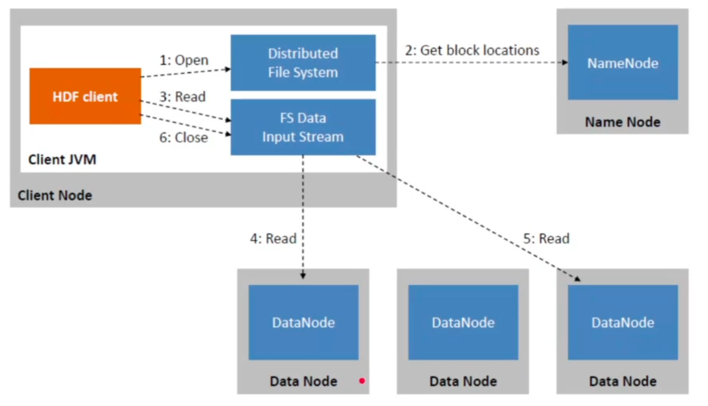
- ### Запись файла
- 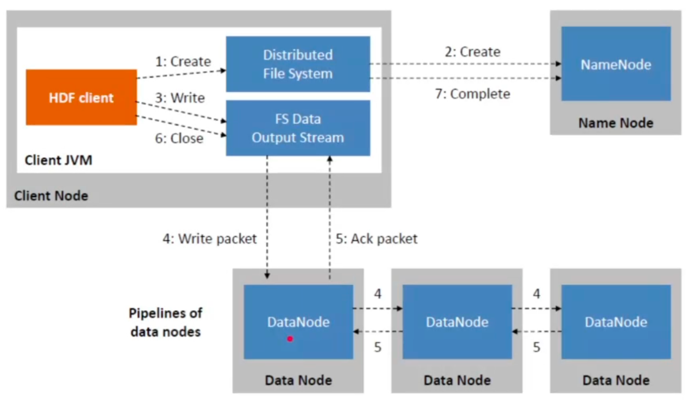
-
- ## Федерации
- 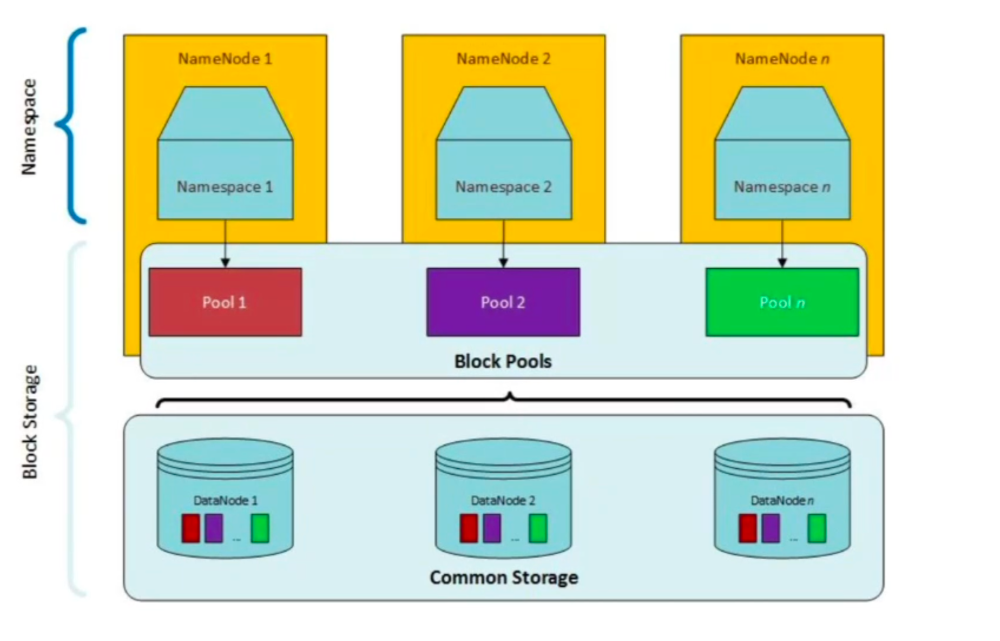
-
- **Команды HDFS**
- ```bash
  hdfs dfs -ls # список файлов
  hadoop fs -ls # список файлов (легаси)
  hdfs dfs -mkdir /<path>/ # создание каталога
  hdfs dfs -ls /<path>/ # список файлов в папке
  hdfs dfs -put <file> /<path>/ # скопировать локальный файл на hdfs
  hdfs dfs -cat /<path>/<file> # прочитать файл
  hdfs dfs -cp /<path_old>/<file> /<path_new>/<file> # скопировать файл
  hdfs dfs -get <path>/<file> <path> # скачать файл на локальную машину
  hdfs dfs -du -h /<path>/ # показать размеры файлов в директории
  hdfs fsck /<path>/ -files -blocks -locations # показать инфу о файле/директории
  hdfs dfs -rm -r <file> # удалить файл(в корзину)
  hdfs dfs -rm -r -skipTrash <file> # удалить файл(минуя корзину)
  hdfs dfs -df -h # проверить заполненность hdfs
  ```
  
  
  Команды локального клиента
  ```bash
  pwd # путь к текущему расположени/
  ls # список файлов
  echo 'Текст файла' > <file> # создание файла
  cat <file> # прочитать файл
  rm <file> # удалить файл
  ls /etc/hadoop/conf # показать файлы конфигов hadoop
  cat /etc/hadoop/conf/hdfs-site.xml # открыть конфиг hadoop
  ```
- # YARN
  
  Модуль отвечающий за управление ресурсами кластеров и планированием задач
- ## Контейнеры
- 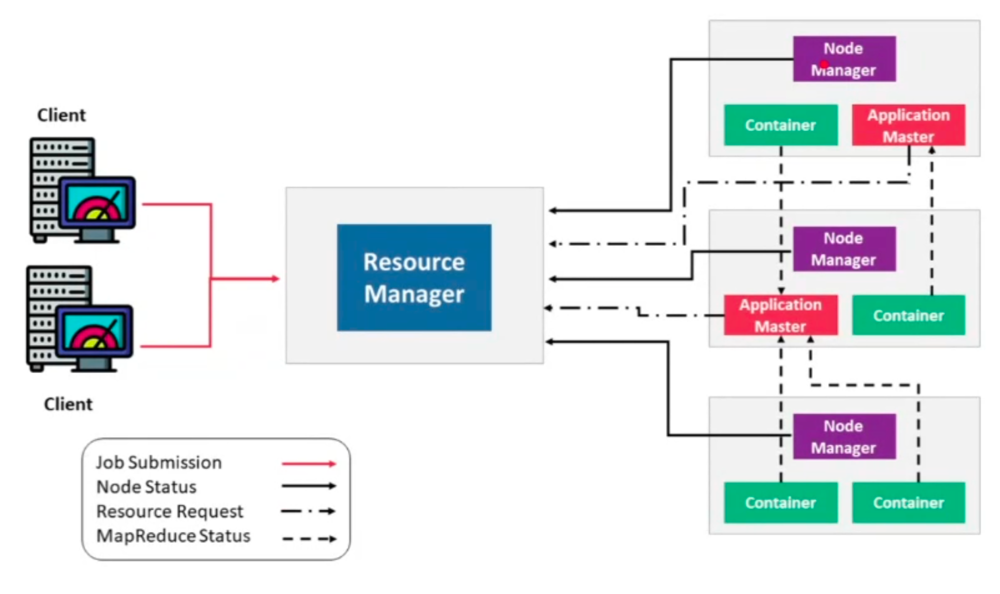
- ## Очереди
  
  Распределение ресурсов происходит по очередям
  
  Примеры:
- Очередь для долгих и тяжелых задач
- Очередь для мелких ad-hock запросов
- Очередь для обучения моделей
- Очередь для отдельного отдела
- …
  
  ```bash
  yarn -h # посмотреть команды yarn
  yarn logs -conatinerId <id> # посмотреть логи контейнера
  yarn top # посмотреть процессы в онлайн
  yarn app -list # список запущенных приложений
  yarn app -kill <id> # закрыть приложение
  ```
- # MapReduce
	- Подход к вычислению
	  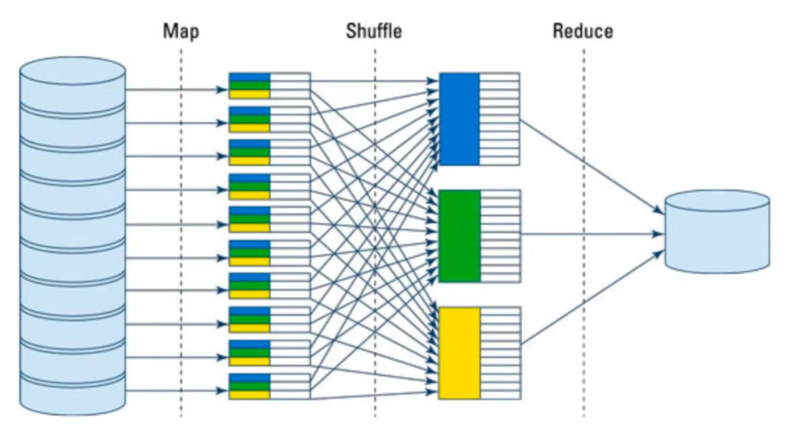
	- Пример word count
		- Mapper: (val4, 1), (val45, 1), (val5, 1), …, (valN, 1)
		- Sort: (val1, [1, 1]), (val2, [1]), (val3, [1, 1, 1, 1]), … (valN, [1, …, 1])
		- Reduce: (val1, 2), (val2, 1), (val3, 4), … (valN, N)
	- 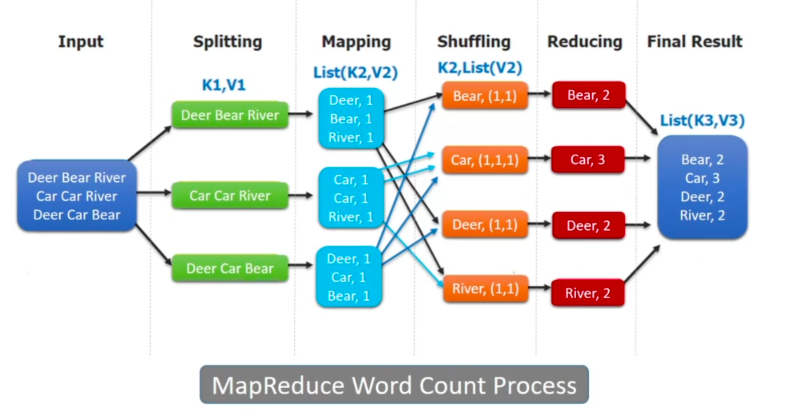
	- 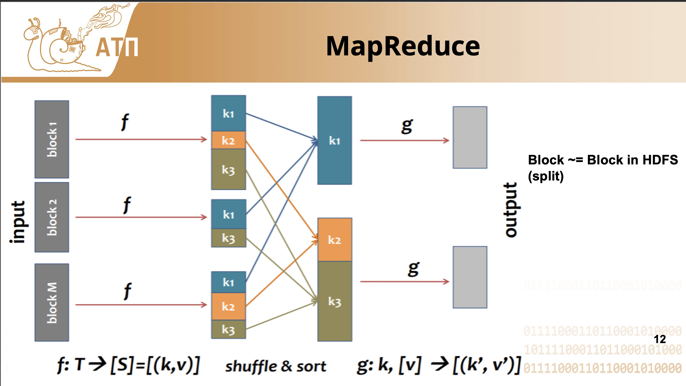
	- 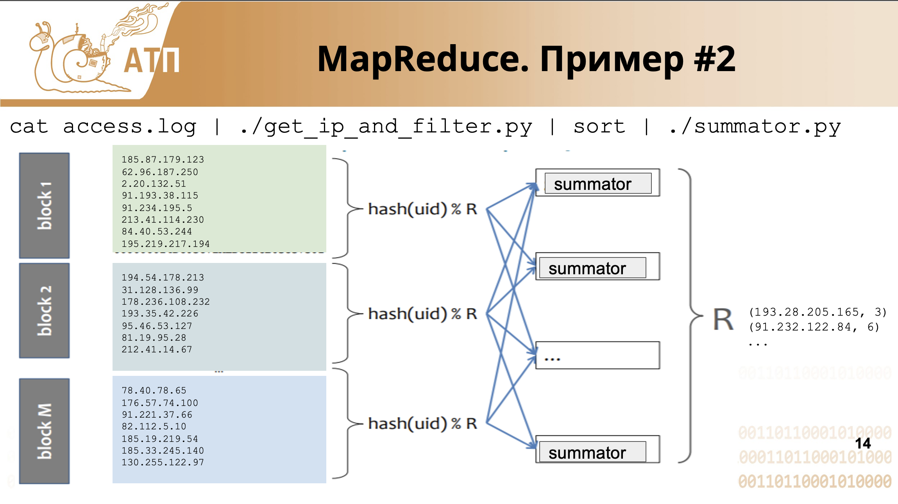
	-
- Комбайнер - промежуточный редьюсеры
- 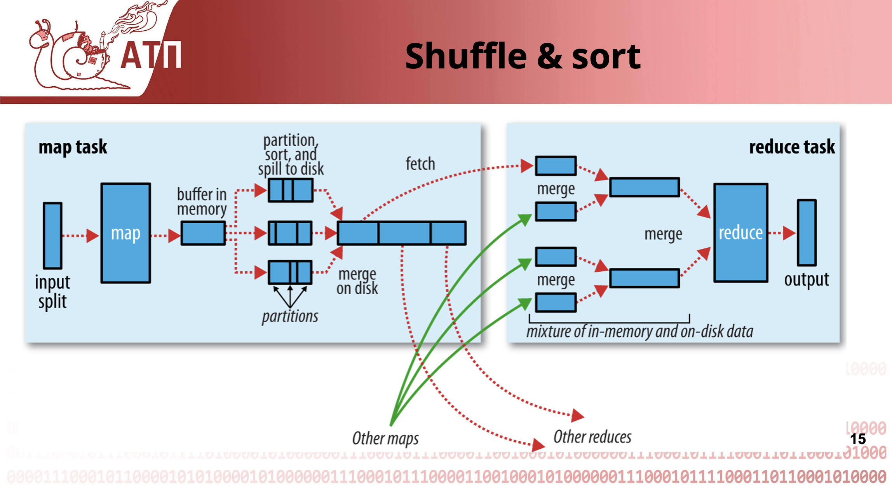
- 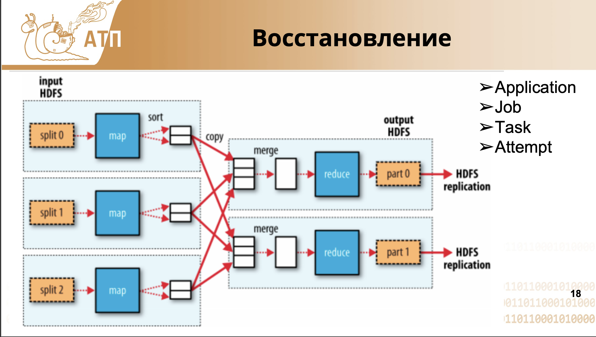
-