public:: true

- [Документация pandas](https://pandas.pydata.org/docs/)
- Импорт библиотеки
  ```python
  import pandas as pd
  ```
-
- [[Подключение к GP через pandas]]
- Создание датафрейма из словаря
  ```python
  df = pd.DataFrame({
  	'col_name_one': ['lol', 'kek', 'cheburek'],
  	'col_name_two': [1, 2, 3]
  })
  ```
  
  Создать датафрейм из списка списков
  ```python
  df = pd.DataFrame([
  	['Maks', 26, 'M'],
  	['Andrey', 28, 'M'],
  	['Inna', 28, 'W']
  ], columns=['name', 'age', 'sex'])
  ```
  
  Чтение файла
  ```python
  df = pd.read_csv(
  	'file_name.csv', # Расположение и имя файла
  	encoding='windows-1251', # Кодировка
  	index_col=0, # Указать первую колонку, как индекс
  	sep=';', # Разделитель
  	parse_dates=['start_at', 'end_at', 'arrived_at'] # Колонки с датой
  )
  
  # Можноо прочесть zip сразу
  pd.read_csv('file_name.csv.zip', compression='zip')
  ```
  
  Сохранение файла
  ```python
  df.to_excel('file_name.xlsx', index=False)
  ```
- ### Основные методы
  
  ```python
  df.head(n) # Показать первые строки. n - количество. По умолчанию 5
  df.tail(n) # Показать последние строки. n - количество. По умолчанию 5
  df.shape # Показать количество строк и колонок
  df.dtypes # Показать типы колонок
  df.describe(include='all') # Рассчитать стандартные метрики
  
  df.sort_values(['col_name'], ascending=[False]) # Сортировка от дольшего к меньшему
  df.astype(str) # Поменять тип всех колонок
  df.astype({'col_1': 'type', 'col_2': 'type'}) # Поменять тип определенных колонок
  
  df.reset_index() # Перевести индекс в колонку
  df.reset_index(drop=True) # Удалить индексы
  df.set_index('col_name') # Сделать колонку индексом
  
  df.fillna('value') # Заполнить пустые ячейки значением 'value'
  df.isna() # Показать пустые значения
  ```
  
  Дубли
  ```python
  df.drop_duplicates() # Удалить дубли
  df.drop_duplicates(subset=['col_name_one', 'col_name_two']) # Смотреть дубли в определенных колонках
  df.loc[df.duplicated()] # Показать строки, в которых есть дубли
  ```
  
  Удалить строки, в которых есть пустые значения
  ```python
  df.dropna() # Удалить строки, в которых есть пустые значения
  df.isna() # Показать пустые значения
  df.isna().sum() # Сумма пустых ячеек в каждой колонке
  ```
  
  ```python
  df.notna() # Антоним isna()
  ```
- ### Методы для работы со строками
  
  Показать список строк
  ```python
  df.index
  ```
  
  Удаление строки по индексу
  ```python
  num_index = 0
  df.drop(index=num_index)
  ```
  
  Перебрать датафрейм по строкам
  ```python
  for index, row in df.iterrows():
    print(f"Тип индекса: {type(index)},\\nСодержимое: {row}")
  
  for index, row in df.iterrows():
    print(f"Индекс: {index},\\Конкретная колонка: {row['col_name']}")
  ```
  
  Пробегает по строкам датафрейма и возвращает их в виде кортежа
  ```python
  for row in nyc.itertuples():
    print(row.key_name)
    print(row[num_index])
  ```
  
  Разбить список на строки
  ```python
  # Сделать из строки список
  df.assign(
    column=lambda df: df.column.apply(lambda old_list: eval(old_list))
  )
  
  df.explode('column_name')
  ```
- ### Методы для работы с колонками
  
  ```python
  df[['col_name_one', 'col_name_two']] # Выбрать определенные колонки
  df['col_name_one'] # Выбрать определенную колонку
  df.loc[:, '1':'4'] # Выбрать колонки '1' - '6'
  df.loc[df['name'] == 1, '1':'4'] # Выбрать колонки '1' - '6' с фильтром
  df.loc['2018-06-01': '2018-08-31'] # Выбрать диапозон дат(индекс в формате даты)
  df.filter(like='id') # Взять колонки в названии которых есть 'id'
  df.filter(regex='_id') # То же, что и выше, только в регулярке
  df.col_name_one # Выбрать определенную колонку
  df.columns # Показать список колонок
  df.rename(columns={'col_old': 'col_new'}) # Переименовать колонки
  
  df.col_name_one.sum() # Посчитать сумму значений в столбце
  df.col_name_one.count() # Посчитать количество значений в столбце
  df.col_name_one.mean() # Посчитать среднее по значения в столбце
  df.col_name_one.std() # Посчитать стандартное отклонение по значениям в столбце
  df.col_name_one.median() # Посчитать медиану по значениям в столбце
  
  df.col_name_one.unique() # Показать уникальные значения
  df.col_name_one.nunique() # Показать количество уникальных значений
  
  df.fillna({'col_name_one': 1}) # Заполнить пустые ячейки колонки
  df.drop(columns='col_name_one') # Удалить колонку
  
  df.col_name_one.astype(str) # Поменять тип колонки
  ```
  
  Создать новую колонку на основании старой(старых)
  ```python
  df.col_name_one.apply(func_name) # Применить функцию к колонке(Создаст новую колонку)
  df.col_name_one.apply(lambda col_value: col_value + 1) # Можно применить lambda функцию
  
  df.assign(col_name_new=lambda df: df['col_name_one'] + df['col_name_two'])
  df.assign(
  col_name_new = df.col_1 + df.col_2,
  col_name_new_2 = df.col_1 - df.col_2,
  )
  ```
  
  Применение apply к нескольким столбцам
  ```python
  df['distance'] = df[['col1', 'col2', 'col3', 'col4']].apply(lambda row: haversine(row[0], row[1], row[2], row[3]), axis=1)
  
  # более медленный вариант
  df['distance'] = df.apply(lambda x: haversine(x['col1'], x['col2'], x['col3'], x['col4']), axis=1)
  ```
  
  Применение функции с помощью векторизации
  ```python
  df['new_column'] = my_func(df.col_1, df.col_2)
  
  ## ВАЖНО: ваша функция должна уметь работать с сериями pandas
  ## Например использовать numpy
  
  # Можно ускорить выполнение, сразу передав серию numpy, а не pandas
  df['new_column'] = my_func(df.col_1.values, df.col_2.values)
  ```
  
  Получить количество каждого значения в колонке
  ```python
  df.column.value_counts()
  ```
  
  Получить процент каждого значения в колонке
  ```python
  df.column.value_counts(normalize=True)
  ```
  
  Привести колонку в целые числа(округлив)
  ```python
  df.column.round()
  ```
  
  Умножить колонку на n
  ```python
  df.column.mul(n)
  ```
  
  Мода
  ```python
  df.column_name.mode()
  ```
  
  Дисперсия
  ```python
  df.A.var()
  ```
  
  Стандартное отклонение
  ```python
  df.A.std()
  ```
  
  **Квантили**
  
  `quantile` – метод для поиска определённых [перцентилей](http://statistica.ru/glossary/general/kvantil/). Принимает число от 0 до 1, обозначающее перцентиль в виде доли:
- 0 – 0-ой перцентиль
- 0.1 – 10-ый перцентиль
- 0.75 – 75-ый перцентиль (он же 3-ий квартиль)
  
  Перцентиль
  ```python
  df.column.quantile(q=n)
  
  df.column.quantile() # По умолчанию - 0.5, то есть медиана
  df.column.quantile(q=0.25) # 25 перцентиль
  
  df.column.quantile(q=[0.25, 0.5]) # 25 перцентиль и медиана
  
  # Если значения поцентиля нет, то pandas сам его линейно выведет
  # Но, можно самому задать направление
  df.column.quantile(q=0.25, interpolation='higher') # higher - выберет большую точку из смежных
  ```
  
  Преобразование вещественных значений в категории
  ```python
  category_list = [1, 2, 3, 4]
  labels_list = ['one', 'two', 'three', 'four']
  
  pd.cut(df, category_list, labels=labels_list)
  ```
  
  Заменить inf на NA в колонке/серии pandas
  ```python
  df.column_name.replace(-float('inf'), pd.NA)
  ```
  
  ```python
  pd.Series().all() # Все ли значения в серии True?
  pd.Series().any() # Есть ли в серии хотя бы одно значение True?
  ```
  
  ```python
  df.col_name.describe() # Получить основные метрики серии(колонки)
  df.col_name.describe().top # Получить самое частовстречающее значение
  
  df.col_name.value_counts().idxmax() # Аналог строки выше
  ```
- ## Str
  
  Строки, которые начинаются с substr
  ```python
  df[df.column.str.startswith(substr)]
  ```
  
  Привести колонку к верхнему регистру
  ```python
  df.column.str.upper()
  ```
  
  Взять n символов в значении
  ```python
  df.column.str[:n]
  ```
  
  Сплит
  ```python
  df.column.str.split(simbol)
  df.column.str.split(simbol).str[num]
  ```
- ### **Парсинг строковых колонок**
  
  Вытаскивает данные по регуляркам
  
  ```python
  df['column'].str.extract('(?P<name>\\w+), \\((?P<data>.+)\\)')
  ```
- 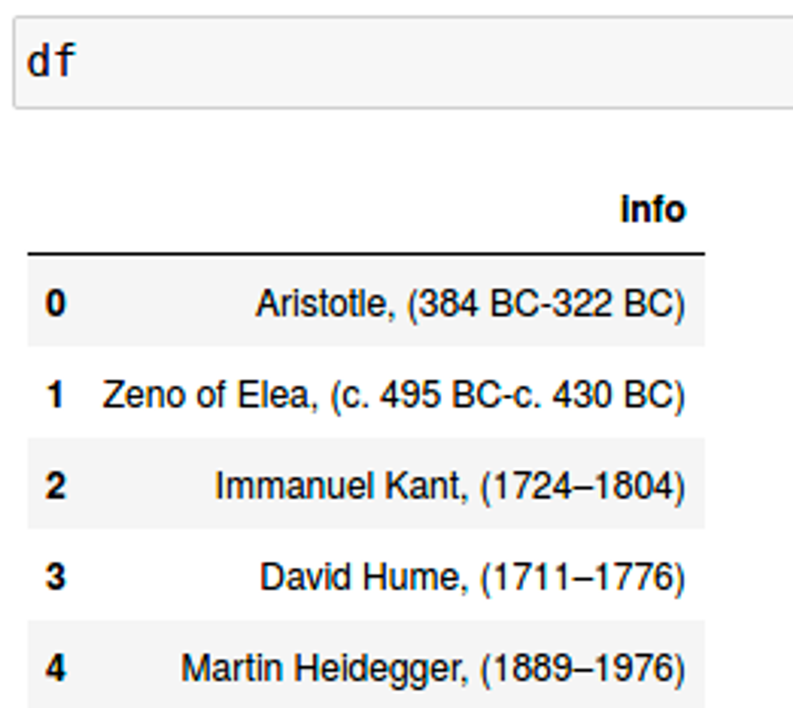{:height 300, :width 276} 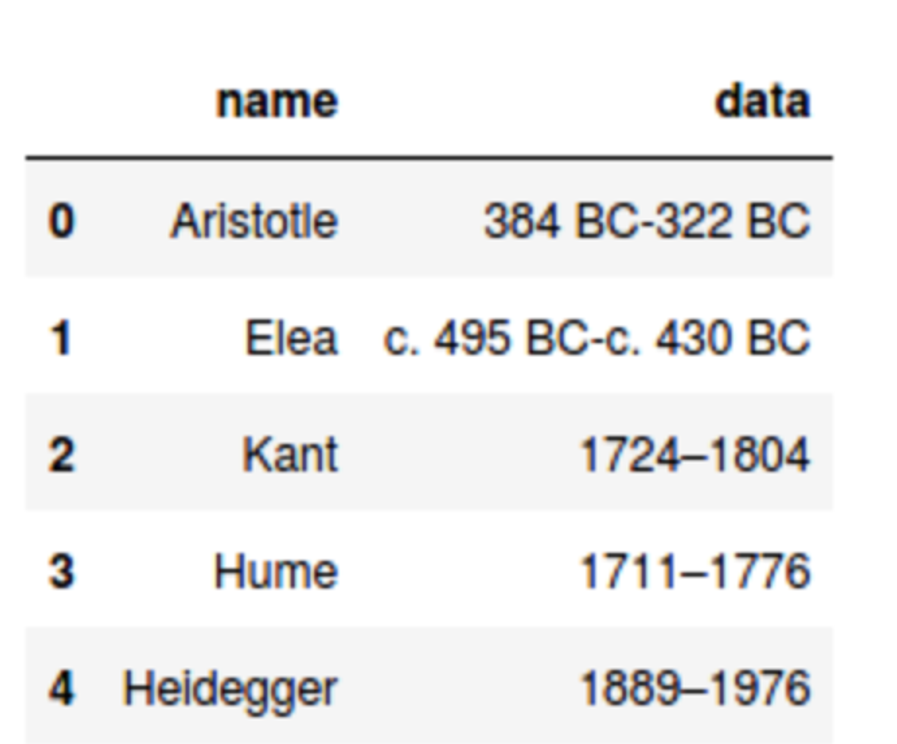{:height 521, :width 298}
-
- ## Преобразования датафрейма
  
  Преобразовать серию в датафрейм
  ```python
  pd.Series([1, 2, 3, 4, 5]).to_frame().reset_index()
  ```
  
  Поменять формат колонок и данных
  ```python
  df.pivot(
  index='col_for_index',
  columns='col_for_column',
  values='col_for_values'
  ).reset_index()
  
  df.pivot_table(
  index='col_for_index',
  columns='col_for_column',
  values='col_for_values',
  aggfunc='func'
  ) # То же, что и выше, но, можно применить аггрегирующую функцию на столбец со значениями
  ```
- ### Работа с датой
  
  ```python
  date_column = pd.to_datetime(
  df.col_name_one,
  dayfirst=True # Принять дату в формате день-месяц-год
  ).col_name_one
  
  date_column.dt.day # Показать день
  date_column.dt.month # Показать месяц
  date_column.dt.date # Показать дату
  
  df.col_name.astype('datetime64') # Преобразовать колонку в формат даты
  pd.to_datetime(df.col_name_one) # Аналог строки выше
  pd.to_datetime(df.col_name_one, unit='s') # Перевести секунды в читаемый формат
  ```
-
- ## resample
  |Date Offset|Обозначение|Описание|
  |--|--|--|
  |DateOffset|None||
  |Week|'W'|одна неделя|
  |MonthEnd|'M'|конец календарного месяца|
  |MonthBegin|'MS'|начало календарного месяца|
  |QuarterEnd|'Q'|конец календарного квартала|
  |YearEnd|'A'|конец календарного года|
  |YearBegin|'AS' или 'BYS'|начало календарного года|
  |Day|'D'|день|
  |Hour|'H'|один час|
  |Minute|'T' или 'min'|одна минута|
  |Second|'S'|одна секунда|
  |Milli|'L' или 'ms'|одна миллисекунда|
  |Micro|'U' или 'us'|одна микросекунда|
- ```python
  # Сумма показателя по дням
  df.resample(rule='D').sum()
  
  # Данные за каждые 6 часов
  df.resample(rule='6H').sum()
  
  ## Индекс должен быть в формате даты/времени
  ## rule - период
  ```
  
  Группировка по столбцу
  ```python
  df.groupby('usertype').resample(rule='D').size().T
  ```
- ### Условия
  
  ```python
  my_list = [1, 3, 4]
  
  df[df['col_name_one'] > 1] # Простое условие
  df.query('col_name_one > 1') # Аналог строки выше
  
  df[df['id'].isin(my_list)] # Условие на вхождение в список
  df.query('id in @my_list') # Аналог строки выше
  ```
- ### Группировки
  
  Стандартная группировка
  ```python
  df.groupby(
  ['col_name_one', 'col_name_two'],
  as_index=False # Параметр отвечающий за сохранение прежних индексов
  ).agg({'col_name_n': 'func_name'})
  ```
  
  Взять одну самую верхнюю строку в каждой группе
  ```python
  ## Первый способ
  df \\ 
  .sort_values('columns_for_sort', ascending=False)\\
  .groupby('column_for_group', as_index=False)\\
  .head(1) # Вместо 1 может быть другое количество
  
  ## Способ 2
  df\\
  .groupby('column_for_group', as_index=False)\\
  .apply(
  lambda x: x.nlargest(1, 'columns_for_sort') # Вместо 1 может быть другое количество
  )
  ```
  
  Получить количество уникальных значений в каждой группе
  ```python
  df\\
  .groupby('column_for_group', as_index=False)\\
  .agg({
  'col_part': pd.Series.nunique
  })
  ```
- ## Джоины
  
  <!-- notionvc: 28cfa555-f5da-47f8-9341-72250ca928c2 -->
- ```python
  df_1.merge(
  	df_2,
  	on=['col_name_one'],
  	how='inner' # По умолчанию - inner
  )
  
  df_1.merge(df_2) # Можно и так
  ```
- 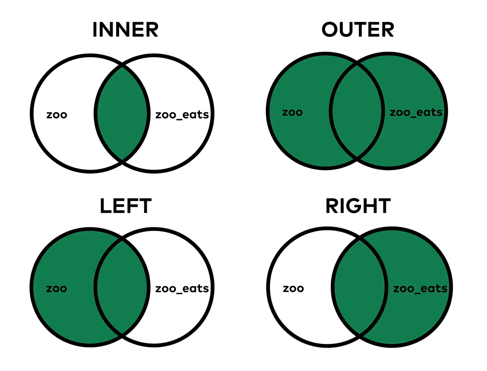{:height 338, :width 405} Типы join
- ## Объединение датафреймов
  
  ```python
  pd.concat([df_1, df_2, df_n])
  df_1.append(df_2)
  ```
- ## Визуализация данных
- [[Визуализация на Python]]
- Визуализация встроенная в pandas
  ```python
  df.col_name_one.plot(
  	'hist', # Тип диаграммы. В данном случае гистограмма
  	bins=15 # Число диапазонов (корзин/бакетов), на которые мы разделяем значения.
  )
  
  df.col_name_one.plot.hist(bins=15) # Аналог верхней записи
  ```
- ## Оконные функции
  
  Скользящее среднее
  ```python
  # Берем num чисел и считаем по ним среднее
  # Сдвигаеся на i+1
  # Берем num чисел и считаем по ним среднее
  # ...
  df.column_name.rolling(window=num).mean() # num - количество значений для окна
  
  # Если нужно, чтобы после скольжения не оставалось пустых значений - можно указать минимальное кол-во для подсчета среднего
  df.column_name.rolling(num, min_periods=x).mean()
  ```
- 
- Экспоненциальное скользящее сглаживание
  ```python
  # Приоритет отдается более новым записям
  df.ewm(span=num).mean()
  ```
-
- ## Мультииндексы
- ### stack
  
  `Stack` — помещает уровень столбцов в уровни индекса строк
  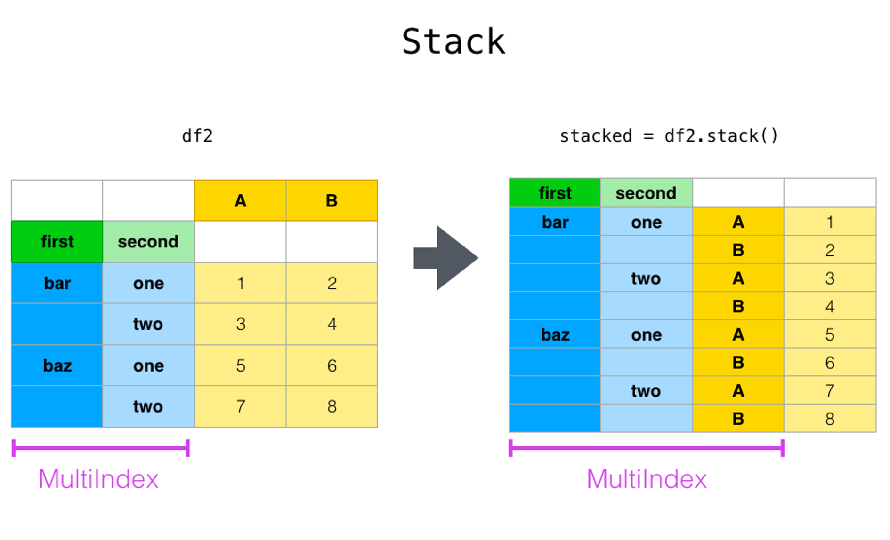
- ```python
  df_stacked = df.stack()
  
  # Задаем названия новым колонкам
  df_stacked.index.names = ['id', 'column']
  ```
- 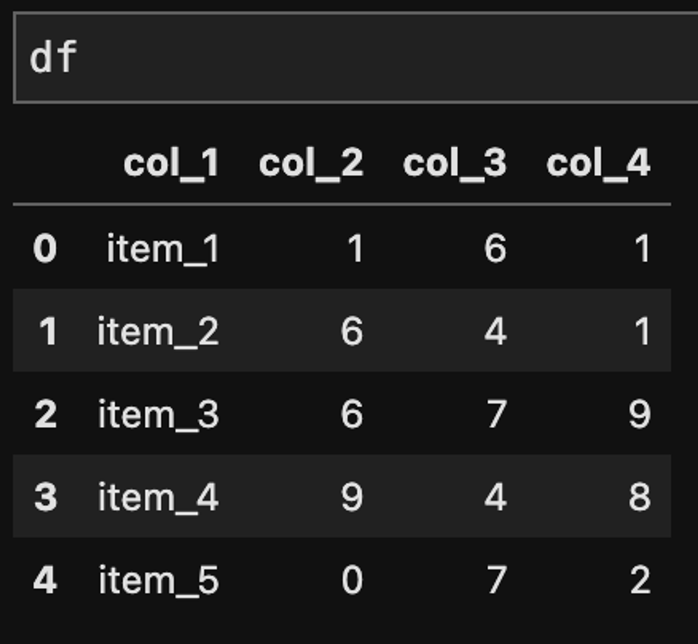{:height 539, :width 282} 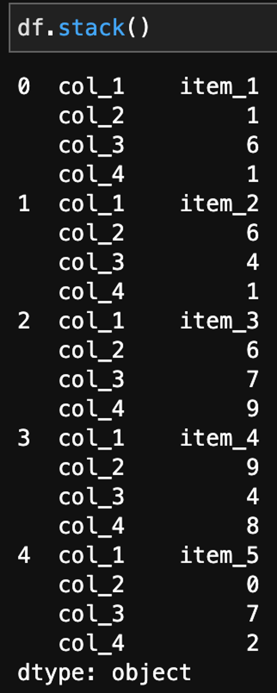{:height 1783, :width 338}
- Оставить пустые строки
  ```python
  df.stack(dropna=False)
  ```
- ## Style
  
  Сохранить цветной датафрейм в excel
  ```python
  df.to_excel('styled.xlsx', engine='openpyxl')
  ```
- `df.style.highlight_null()` – подсветить ячейки с пропущенными значениями
- `df.style.highlight_max()` – подсветить ячейки с максимальными значениями по колонкам
- `df.style.highlight_min()` – подсветить ячейки с минимальными значениями по колонкам
- `df.style.applymap(func)` – применить стилевую функцию к каждой ячейке датафрэйма
- `df.style.apply(func, axis, subset)` – применить стилевую функцию к каждой колонке/строке в зависимости от `axis`, `subset` позволяет выбрать часть колонок для оформления
- `render()` – после декорирования возвращает HTML, описывающий табличку
  
  Спрятать индексы
  ```python
  df.style.hide_index()
  ```
  
  Написать название таблицы
  ```python
  df.set_caption('Cool table')
  ```
- ### **раскрашиваем ячейки**
  
  **highlight_min/max**
  
  `highlight_max` – подсвечивает (выделяет) цветом наибольшее значение. Можно применить либо к каждой строке (`axis=0/'index'`), либо к каждой колонке (`axis=1/'columns'`).
  
  Максимальное значение в каждой строке
  ```python
  df.style.highlight_max(axis=1, color='orange')
  ```
  
  Максимальное значение в каждой колонке
  ```python
  df.style.highlight_max(axis='index', color='orange')
  ```
  
  Минимальное значение
  ```python
  df.style.highlight_min()
  ```
  
  Цвет фона
  ```python
  df.style.highlight_null('white')  # делаем белый фон для значений NaN
  ```
- ### **background_gradient**
  
  `background_gradient` – раскрашивает ячейки в зависимости от их значений. В итоге получается что-то похожее на heatmap (тепловую карту). Например:
- ```python
  (df.style
   .highlight_min('A', color='red')
   .highlight_max('B', color='orange')
   .background_gradient(subset=['C','D'],cmap='viridis')
  )
  ```
- 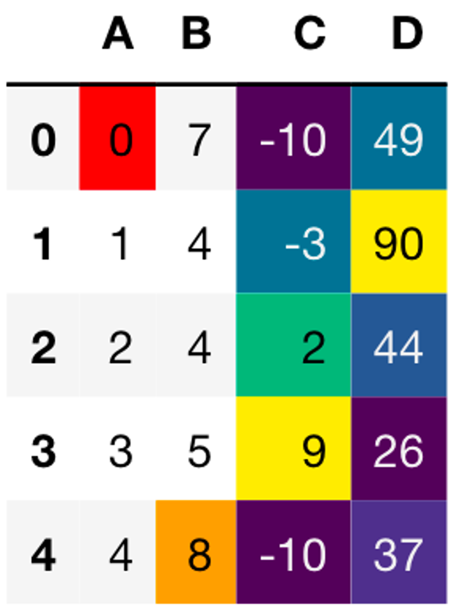{:height 494, :width 363}
- Варианты cmap
- `viridis` - последовательный градиент от фиолетового до желтого
- `plasma` - последовательный градиент от синего до красного
- `inferno` - последовательный градиент от черного до оранжевого
- `magma` - последовательный градиент от черного до розового
- `cividis` - последовательный градиент от черного до желтого
- `cool` - последовательный градиент от фиолетового до зеленого
- `coolwarm` - дивергентный градиент от синего до красного
- `bwr` - дивергентный градиент от синего до белого до красного
- `RdBu` - дивергентный градиент от красного до белого до синего
- `PiYG` - дивергентный градиент от розового до белого до зеленого
- `RdYlGn` - градиент от красного к зеленому
- `RdYlGn_r` - градиент от зеленого к красному
-
- ### **style.bar**
  
  Визуализировать значения можно прямо в таблице с помощью `.bar()`. Данный метод принимает несколько аргументов:
- `subset` – для каких колонок нужно построить небольшой барплот
- `color` – цвет
  ```python
  df.style.bar(
  	subset=['C', 'D'],
  	color='#67A5EB'
  )
  ```
- 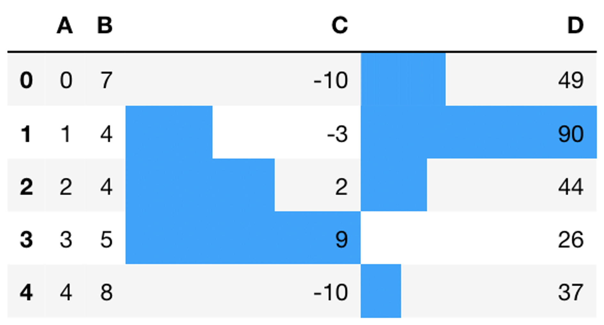{:height 228, :width 381}
-
- • `align` –  как выровнять столбики (`mid` – центр ячейки в (max-min)/2; `zero` – ноль находится в центре ячейки; `left` – минимальное значение находится в левой части ячейки)
- ```python
  df.style.bar(
  	subset=['C', 'D'],
  	color='#67A5EB',
  	align='mid'
  )
  ```
- 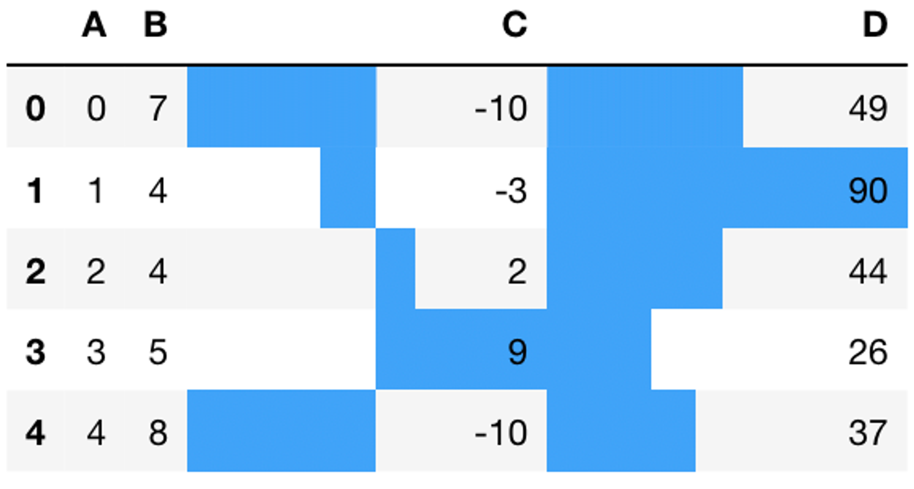{:height 262, :width 403}
-
- Также можно указать сразу несколько цветов. Значения меньше 0 будут окрашены в красный, больше – в зелёный.
- ```python
  (df
   .style
   .hide_index()
   .bar(
  		subset=['C'],
  		align='mid',
  		color=['#d65f5f', '#5fba7d']
  	)
  )
  ```
- 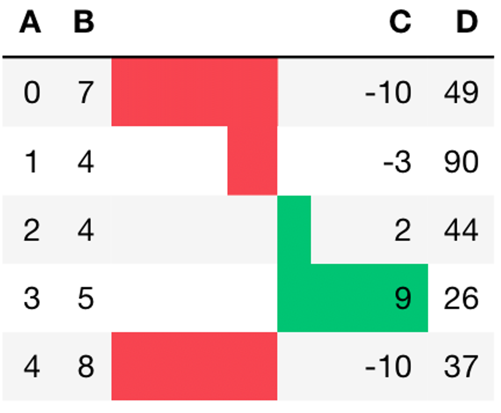{:height 352, :width 380}
- ## Ф **орматирование отображения чисел**
  
  Форматируем:
- оставляем только 2 знака после точки
- добавляем знак + для положительных значений
- применяем ко всем колонкам, кроме `F`
- ```python
  df.style.format(
  	"{:+.2f}",
  	subset=df.columns.drop('F')
  )
  ```
- 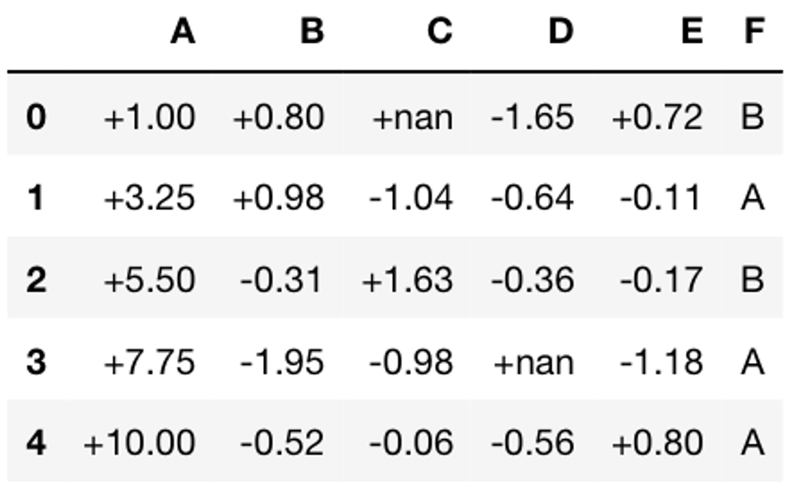{:height 328, :width 384}
-