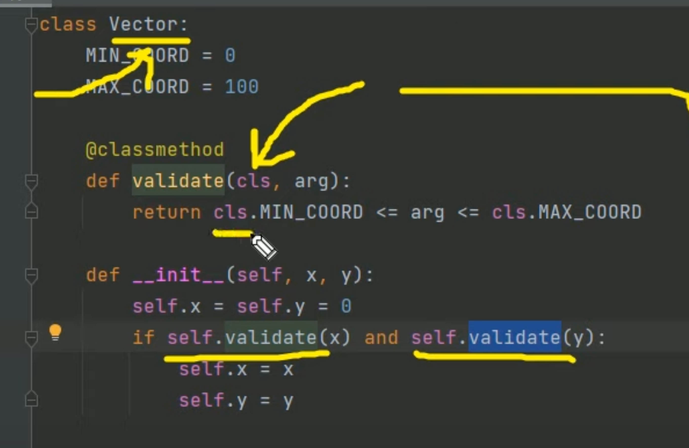
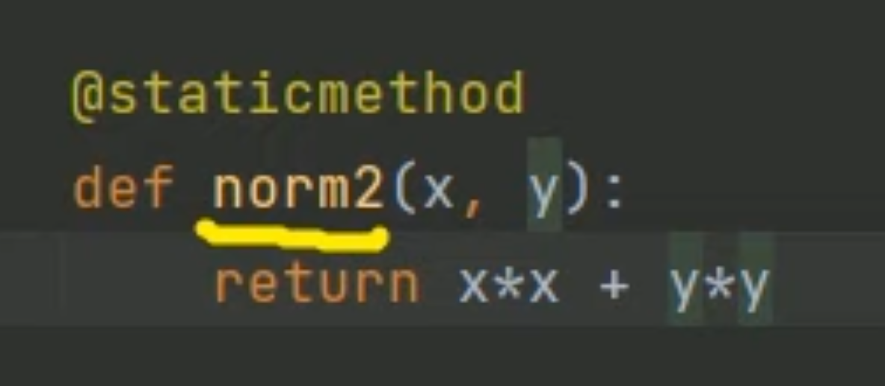

public:: true

- # Libraries
- #[[Pandas]]
- #[[pandahouse]]
- #vertica_python
- #[[pyspark]]
- #[[Prophet]]
- #[[datetime]]
- #[[Визуализация на Python]]
- #[[os python]]
- #[[sys python]]
- #[[re]]
- #[[numpy]]
- #[[vk_api]]
- #[[requests]]
- #[[urllib]]
- #[[json]]
- #[[random]]
- #[[scipy]]
- #[[math]]
- #[[git(python)]]
- #[[zipfile]]
- #[[Отправка сообщений на python]]
-
- ## API
  
  По сути, это библиотека от создателей веб-сервиса (сайта, где можно что-то сделать), позволяющая быстро выполнить действия с этим сервисом. Как правило для работы с API необходимо получить токен.
  
  **Токен** — это уникальная последовательность символов, позволяющая авторизоваться на сайте и работать с API
-
- #[[Google doc API]]
- #[[VK]]
- #[[Яндекс метрики]]
- #[[Telegram]]
-
- ### Стандартные функции
  
  ```python
  print('Hello, world!') # Вывод в консоль
  var = input('Напиши что-нибудь') # Получение данных от пользователя
  len(var) # Длина переменной (списка, строки, словаря и т д)
  range(x1, xn, step) # Генератор чисел от x1 до xn с шагом step
  
  type(x) # Показать тип переменной
  help(x) # Показать информацию о методеде/классе/свойстве
  dir(x) # Показать методы и свойства x
  x.__doc__ # Дока объекта x
  
  exit()  # Остановить выполнение программы
  break # Остановить выполнение цикла
  continue # Остановить итерацию цикла и сразу перейти к следующей
  pass # Пустой блок
  throw error # Записать данные в ошибку, error - переменная
  
  __name__ # Свойство на уровне класса python, которое хранит в себе значение, откуда запущен файл. Значение '__main__' заполнится, если переменная проверяется в главном файле
  ```
  
  Подключение модулей и библиотек
  ```python
  import a # Иморт библиотеки a
  import a as b # Импорт библиотеки a с переименованием в b
  from a import c # Импорт модуля c из библиотеки a
  from a import * # Импорт всех модулей библиотеки a
  from j.a import * # Импорт всех модулей библиотеки a из пакета j
  ```
- ## Переменные
  
  ```python
  x = 12 # Создание переменной
  
  global y # Обозначение глобальной переменной
  y = 13
  
  nonlocal z  #создание переменной, которая действует внутри нескольких функций
  z = 14
  
  x *= n # Увеличить x в n раз. Аналог x = x * n
  ```
- ## Типы данных
	- ### Строки (str)
		- Форматирование строк
		  
		  ```python
		  name = 'Maks'
		  
		  '\\n' # Перенос строки 
		  '\\' # Экранирование
		  
		  f'my name: {name}'
		  'my name: {}'.format(name)
		  'my name: {name}; my age: {age}'.format(name=name, age=26)
		  
		  # Вывод десятичных чисел.
		  '{0:.n}'.format(1/3) # n - количество символов после .
		  
		  # Вывод процентов
		  '{0:.n%}'.format(1/3) # n - количество символов после . % дает понять, что нужно умножить на 100 и приписать %
		  
		  # Несколько значений
		  '{0:.2f} {1:.3f}'.format(0.1234, 0.567)
		  
		  # Вывод строки с определенной длиной
		  x = '{0:_^11}'.format('hello')
		  
		  print(x, len(x))
		  >> ___hello___ 11
		  ```
		- Методы строк
		  ```python
		  my_string = 'lol kek cheburek'
		  symbol = '.'
		  - my_string[n] # Достать символ с индексом n; Индексы начинаются с 0 и могут быть отрицательными, чтобы выбирать с конца
		  my_string.split(' ') # Получим список из строки разделенной по пробелу
		  my_string.startswith(symbol) # Проверяет, что строка начинается на заданный символ(подстроку)
		  my_string.strip() # Удаляет пробелы вначале и конце строки
		  ```
	- ### Списки
	  список - list
	  
	  ```python
	  my_random_list = [0, 1, 24, 'lol', {'a': '23'}]
	  ```
	  
	  Методы списков
	  ```python
	  my_list = [1, 2, 3, 3, 5]
	  
	  my_list[n] # Достать элемент с индексом n. Индексы начинаются с 0 и могут быть отрицательными, чтобы выбирать с конца
	  
	  my_list.append(0) # Добавить значение в конец списка
	  my_list.sort() # Отсортирует список
	  my_list.sort([key = func]) #сортирует список на основе функции, можно не прописывать функцию, тогда сортировка будет происходить по встроенному алгоритму
	  my_list.extend([6, 7, 1]) # Расширяет список, добавляя к концу все элементы другого списка
	  my_list.insert(i, a) # Вставляет на i позицию элемент a
	  my_list.remove(a) # Удаляет первый элемент в списке со значением a, возвращает ошибку, если такого элемента не существует
	  my_list.pop(i) # Удаляет i-ый элемент и возвращает его, если индекс не указан, удаляет последний элемент
	  my_list.index(a) # Возвращает индекс элемента a (индексация начинается с 0)
	  my_list.count(a) # Возвращает количество элементов со значением a
	  my_list.reverse() # Разворачивает список
	  my_list.copy() # Поверхностная копия списка, при присвоении переменной копии списка, значение данного списка не изменяется в случае изменения первого. Если переменной присвоить список через "=", тогда значение этой переменной будет меняться при изменении оригинала
	  my_list.clear() # Очищает список
	  ```
	  
	  Генератор списка
	  ```python
	  [val * 2 for val in values]
	  ```
-
- ### Кортежи
	- Кортеж является неизменяемым (immutable) типом данных, что означает, что его элементы не могут быть изменены после создания.
	- Кортеж создается с использованием круглых скобок или без скобок, если элементы разделены запятыми.
	- Кортеж может содержать элементы различных типов данных.
	- Доступ к элементам кортежа осуществляется с помощью индексации, начиная с 0.
	- Кортеж занимает меньше памяти, чем список.
	  
	  Создание кортежа
	  ```python
	  my_tuple = (1, 2, 4)
	  my_tuple = (1,)
	  ```
	-
	-
	- ### Словари
	  
	  Стандартный словарь
	  ```python
	  my_dict = {
	  'key_1': 'val_1',
	  'key_2': [1, 2, 3]
	  }
	  
	  dict.fromkeys(['key_1', 'key_2'], 1)
	  # {'key_1': 1, 'key_2': 1}
	  ```
	  
	  Методы словаря
	  
	  ```python
	  my_dict['key_1'] # Получение значения по ключу
	  my_dict.get('key', 'default') # Получение значения по ключу с проверкой на существование
	  
	  del my_dict['key_1'] # Удалить поле
	  my_dict.pop('key_1', 'default') #удаляет ключ и возвращает значение. Если ключа нет, возвращает default
	  
	  my_dict.clear() # Очищает словарь
	  my_dict.copy() # Возвращает копию словаря
	  my_dict.items() # Получение списка с кортежами (key, value)
	  my_dict.keys() # Возвращает ключи в словаре
	  my_dict.values() # Возвращает значения в словаре
	  my_dict.popitem() # Удаляет и возвращает пару (ключ, значение) с конца
	  my_dict.setdefault('key_1', 'default') # Возвращает значение ключа, но если его нет, создает ключ с значением default
	  my_dict.update({'key_1': 'val_2'}) # Обновляет словарь, добавляя пары (ключ, значение) из other. Существующие ключи перезаписываются
	  ```
-
- ## Операторы
	- ### Операторы сравнения
	  
	  Возвращают True или False
	  
	  ```python
	  x = 1
	  
	  x == 2 # Равно
	  x > 0 # Больше
	  x < 3 # Меньше
	  x >= 1 # Больше или равно
	  x <= 5 # Меньше или равно
	  
	  x in [1, 3, 4] # Работает со всеми коллекциями(list, set, dict и.т.д)
	  'l' in 'lelik' # Вхождение подстроки в строку
	  ```
	- ### Условные операторы
	  
	  ```python
	  if x > 1:
	  	print('x больше 1')
	  elif x < 1:
	  	print('x меньше 1')
	  else:
	  	print('x равен 1')
	  ```
- ### Циклы
	- Цикл while
	  ```python
	  while True:
	  	print('Бесконечный цикл')
	  else:
	  	print('Блок выполнится после окончания цикла')
	  ```
	  
	  Цикл for
	  ```python
	  for index in range(0, 10, 1):
	  	print(index)
	  else:
	  	print('Блок выполнится после окончания цикла')
	  
	  for value in [1, 2, 3, 4]:
	  	print(value + 1)
	  ```
	  
	  Перебор сразу нескольких списков(или других коллекций)
	  ```python
	  for value_list_1, value_list_2 in zip(list_1, list_2):
	  	print(value_list_1, value_list_2)
	  ```
- ## Функции
	- Типичная функция
	  ```python
	  def func_name(arg_1: int, arg_n: str='default value') -> str:
	  	return 'Возвращаемое значение'
	  
	  print(func_name('lol', 1))
	  ```
	  
	  Функция с переменным числом параметров
	  ```python
	  def func(*params_tuple, **params_dict):
	    pass
	  
	  func(1, 2, 3, 4, 5, fruits=5, god=20)
	  '''
	    Функция примет параметры в формате:
	    	params_tuple = (1, 2, 3, 4, 5)
	    	params_dict = {
	    		'fruits': 5,
	    		'god': 20
	    	}
	    То есть все, принимает функция без названия парметра попадет в кортеж со *
	    А, все, что с названием параметра в словарь с **
	  '''
	  ```
	  
	  Lambda функция
	  ```python
	  a = lambda x: x*2
	  a(4)
	  ```
- ## Чтение файлов
	- Прочитать текстовый файл построчно
	  ```python
	  path = 'my_txt_file.txt'
	  
	  file = open(path).readlines()
	  file.close() # Всегда нужно закрывать файл после прочтения (либо использовать with)
	  ```
- Обработка ошибок
  
  ```python
  try:
    # Код, который может вызвать исключение
    result = 10 / 0
  except ZeroDivisionError:
    # Обработка исключения ZeroDivisionError
    print("Ошибка: деление на ноль")
  except Exception as e:
    # Обработка других исключений
    print(f"Произошла ошибка: {e}")
  else:
    # Блок, который выполняется, если исключение не возникло
    print("Операция выполнена успешно")
  finally:
    # Блок, который выполняется в любом случае, даже если возникло исключение
    print("Конец программы")
  ```
-
- # Классы
	- Методы класса
		- 
	- Статические методы
		- 
		-