public:: true

- Structured Query Language - Язык для работы с БД
- ## Операции SQL -  `CRUD`
- Create
- Read
- Update
- Delete
- ## Порядок операторов
  
  Обычно операторы используются в следующем порядке:
  
  ```SQL
  SELECT -- перечисление полей для результирующей таблицы
    BuyDate,
    COUNT(*) AS rows
  FROM -- источник данных
    default.checks 
  WHERE -- фильтрация данных
    BuyDate != '2019-03-08'
  GROUP BY -- группировка данных
    BuyDate
  HAVING -- фильтрация данных, аналогично WHERE, при использовании GROUP BY
    COUNT(*) > 215000
  ORDER BY -- сортировка результирующей таблицы
    rows DESC 
  LIMIT 100 -- ограничение на кол-во строк результирующей таблицы
  ```
- ## Основные методы запроса
- ### Простой запрос
- ```SQL
  -- Вывести всю таблицу
  SELECT
  	*
  FROM database.table_name
  
  -- Вывести определенные колонки
  SELECT
    column_1,
    column_2
  FROM database.table_name
  
  -- Вывести определенные колонки переименовав и преобразовав
  SELECT
    column_1 AS new_name_column,
    column_2 * 2 AS new_name_column_2
  FROM database.table_name
  
  -- Вывести определенные колонки с уникальными значениями
  SELECT
    DISTINCT
    column_1,
    column_2
  FROM database.table_name
  
  -- Вывести 50 строк таблицы
  SELECT
  	*
  FROM database.table_name
  LIMIT 50
  ```
-
- Добавить новую колонку со своим значением
  
  ```SQL
  SELECT
    column_1,
    "Значение новой колонки" AS column_new
  FROM database.table_name
  ```
-
- Условия при запросе
  ```SQL
  SELECT
  	*
  FROM database.table_name
  WHERE column_1 > column_2
  AND (column_2 < 1 OR column_2 > 2)
  ```
-
- Сортировка
  ```SQL
  -- Сортировка по убыванию
  SELECT
  	*
  FROM database.table_name
  ORDER BY column_1 DESC 
  
  -- Сортировка по возрастанию
  SELECT
  	*
  FROM database.table_name
  ORDER BY column_1 ASC
  
  -- Можно использовать обе
  SELECT
  	*
  FROM database.table_name
  ORDER BY
    column_1 ASC
    column_2 DESC
  ```
- Минимальное и максимальное значение
  ```SQL
  SELECT
    MIN(column_1),
    MAX(column_2)
  FROM database.table_name
  ```
- Получить первый день месяца
  ```SQL
  SELECT
    toStartOfMonth(date_column)
  FROM database.table_name
  ```
- ## Агрегирование
  
  ```SQL
  SELECT
  column_1,
  column_2,
  ...
  column_n,
  function_agg() AS agg_column
  FROM database.table_name
  GROUP BY
  column_1,
  column_2,
  ...
  column_n
  HAVING -- Фильтрация по выходным данным
  agg_column > 38
  ```
- ## Методы группировки
- |Метод|Описание|Особенности|
  |--|--|--|
  |COUNT(column)|Количество значений|Лучше брать 1 вместо column|
  |COUNT(DISTINCT column)|Количество уникальных значений|Лучше брать 1 вместо column|
  |uniq(column)|Примерное количество уникальных значений(подходит для огромных данных)|Работает в clickhouse|
  |uniqExact(column)|Количество уникальных значений|Работает в clickhouse|
  |AVG(column)|Среднее||
  |MIN(column)|Минимальное||
  |MAX(column)|Максимальное||
  |SUM(column)|Сумма||
  |any(column)|Взять рандомное значение из колонки||
  |median(column)|Медиана||
  |quantile(0.5)(column)|50-й Процентиль(квантиль)||
  |groupArray(column)|Поместить значения колонки в массив||
  |group_concat(value, separator)|строка, которая соединяет значения value через разделитель separator|только SQLite|
  |string_agg(value, separator)|аналог group_concat() в PostgreSQL||
  |percentile_disc(PERCENT)|Перцентиль[:br]PERCENT — порог процентиля (десятичная дробь от 0 до 1)|Нужно использовать спец конструкцию percentile_disc(0.50) within group (order by salary) Рассматривает набор данных как дискретный (то есть состоящий из отдельных значений). Всегда возвращает конкретное значение из тех, что есть в таблице.||
  |percentile_cont(PERCENT)|Перцентиль[:br]PERCENT — порог процентиля (десятичная дробь от 0 до 1)|Нужно использовать спец конструкцию percentile_cont(0.50) within group (order by salary) Рассматривает набор данных как непрерывный (как будто значения в наборе — это выборка из некоторого непрерывного распределения данных).|
- ## Объединение таблиц
- ### JOIN
  
  Слияние воедино путем пересечения по какому-то признаку
  
  **INNER JLON**
  
  Возвращаются только совпадающие строки. Без указания типа `JOIN` используется `INNER`.
- ```sql
  SELECT
  	A.id as id,
  	A.city as city,
  	B.country s country
  FROM table_A as A
  JOIN table_B as B
  	ON A.id = B.id
  ```
- 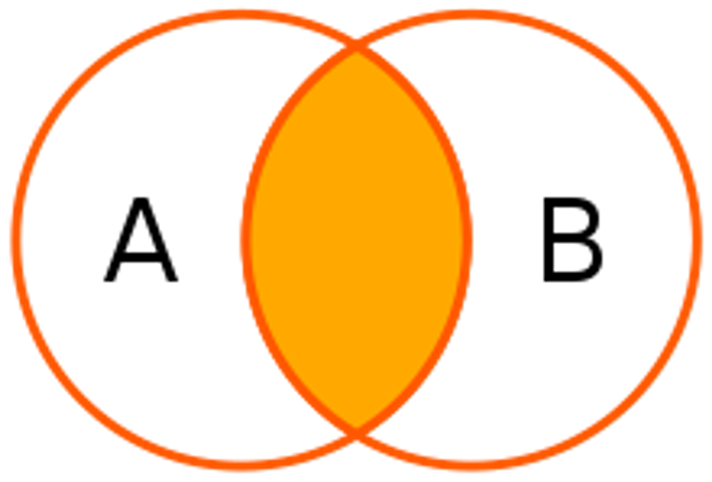{:height 213, :width 304} 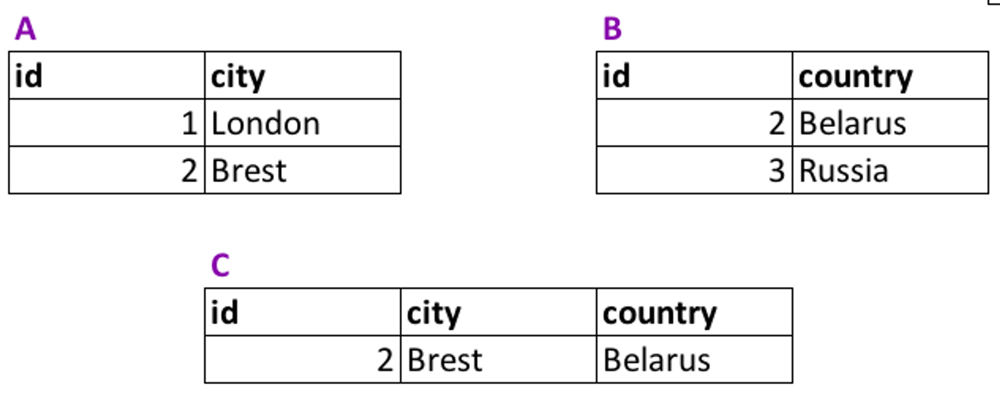{:height 171, :width 417}
-
-
- **LEFT JOIN**
- Возвращаются строки из левой таблицы и соответствующие строки из правой. Как можно заметить, ключевое слово `OUTER` можно опускать и использовать запись `LEFT JOIN`
- ```sql
  SELECT
  	A.id as id,
  	A.city as city,
  	B.country as country
  FROM table_A as A
  LEFT JOIN table_B as B
  	ON A.id = B.id
  ```
- 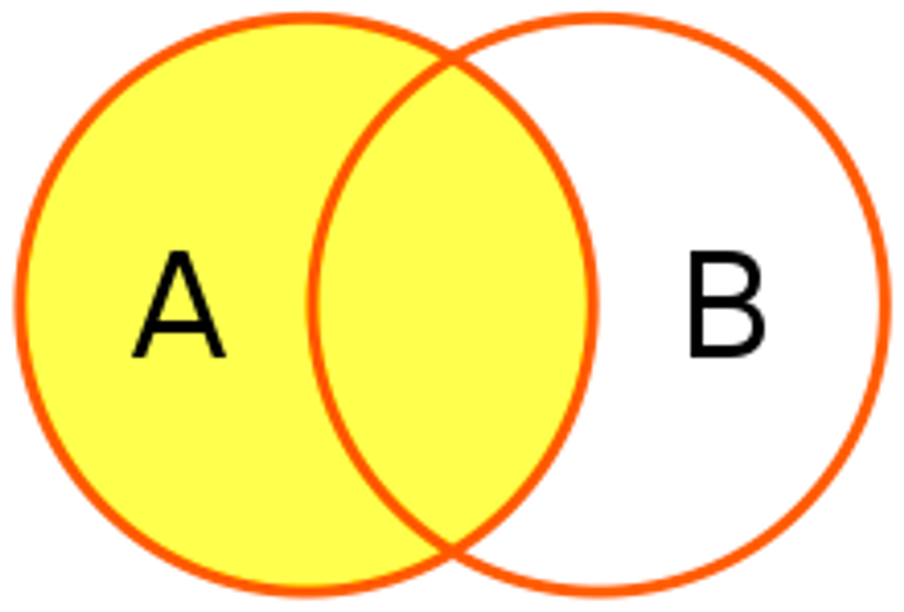{:height 319, :width 344} 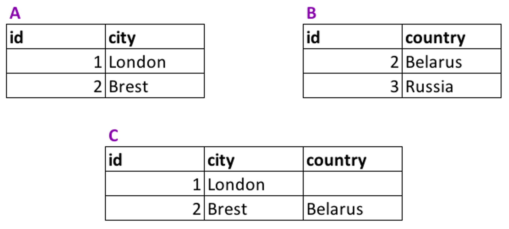{:height 628, :width 407}
-
- **RIGHT JOIN**
- Возвращаются строки из правой таблицы и соответствующие строки из левой.
- ```sql
  SELECT
    A.id as id,
    A.city as city,
    B.country as country
  FROM table_A as A
  RIGHT JOIN table_B as B
  	ON A.id = B.id
  ```
- 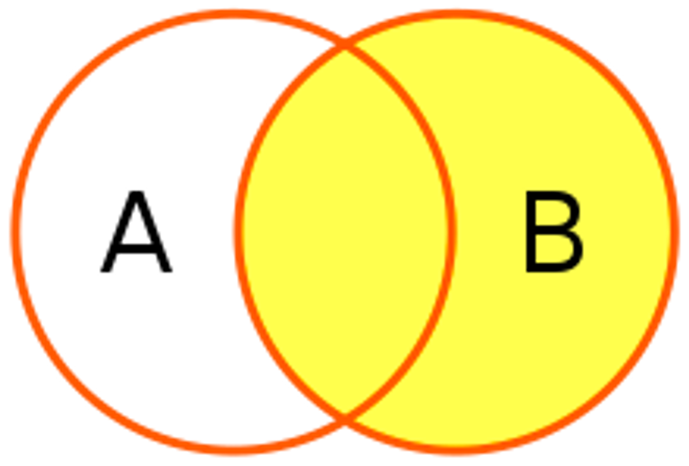{:height 305, :width 365} 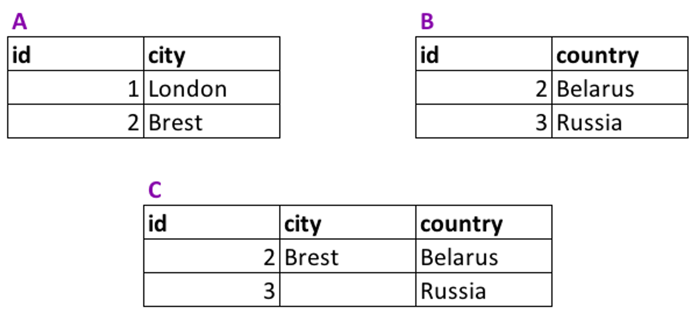{:height 249, :width 397}
-
- **FULL JOIN**
- Возвращаются все строки из обеих таблиц.
  ```sql
  SELECT
    A.id as id,
    A.city as city,
    B.country as country
  FROM table_A as A
  FULL JOIN table_B as B
  	ON A.id = B.id
  ```
- 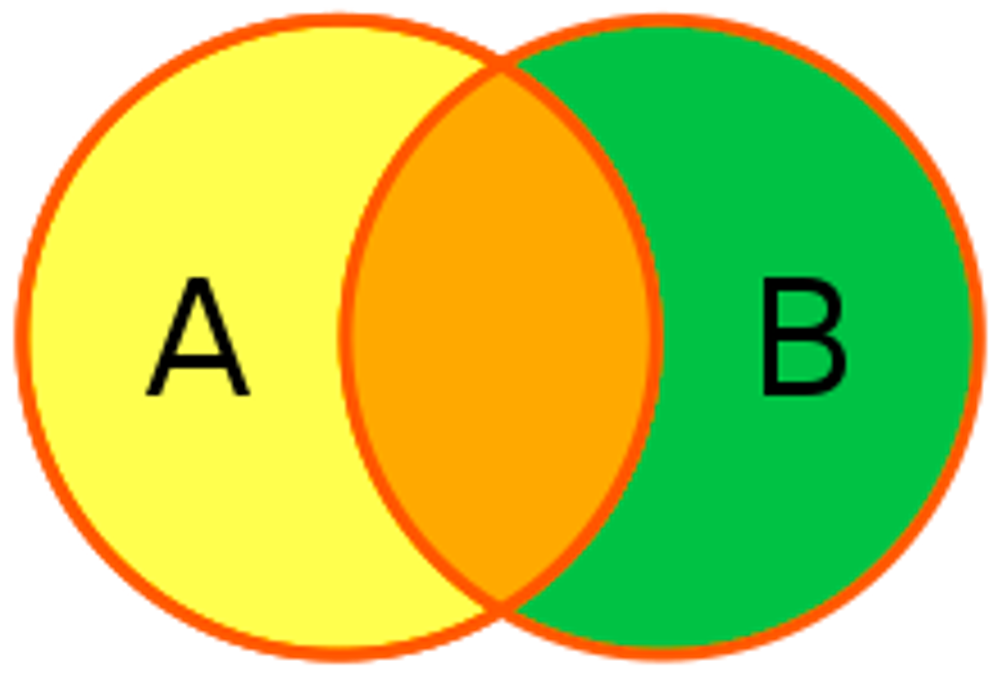{:height 303, :width 350} 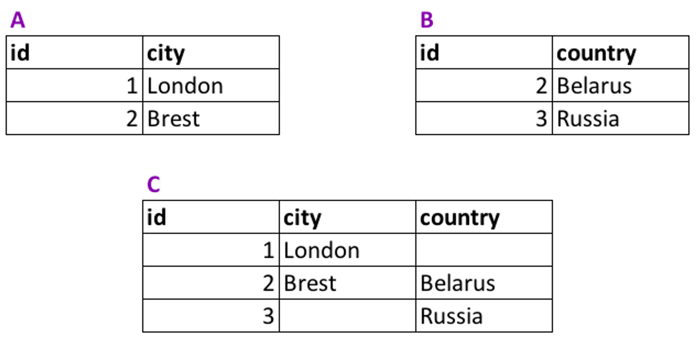{:height 545, :width 408}
-
- **LEFT/RIGHT SEMI JOIN**
- Присутствует не во всех БД.
- `LEFT SEMI JOIN` – возвращает данные только из левой таблички, которые имеют соответствие с правой табличкой. В отличие от `LEFT JOIN`, колонки из правой таблицы добавлены не будут.
- `RIGHT SEMI JOIN` – аналогично, возвращает данные только из правой таблички, которые имеют соответствие с левой табличкой. Дополнительные столбцы из левой таблицы добавлены не будут.
- 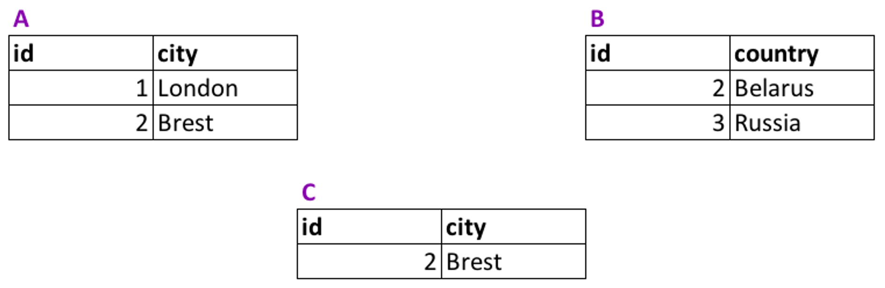
- **CROSS JOIN**
- Перекрёстное соединение. С помощью данного объединения мы получаем возможные комбинации значений из первой и второй таблицы
- ```sql
  SELECT
      *
  FROM A
  CROSS JOIN B
  ```
- При использовании CROSS JOIN ключи соединения указывать не нужно.
- 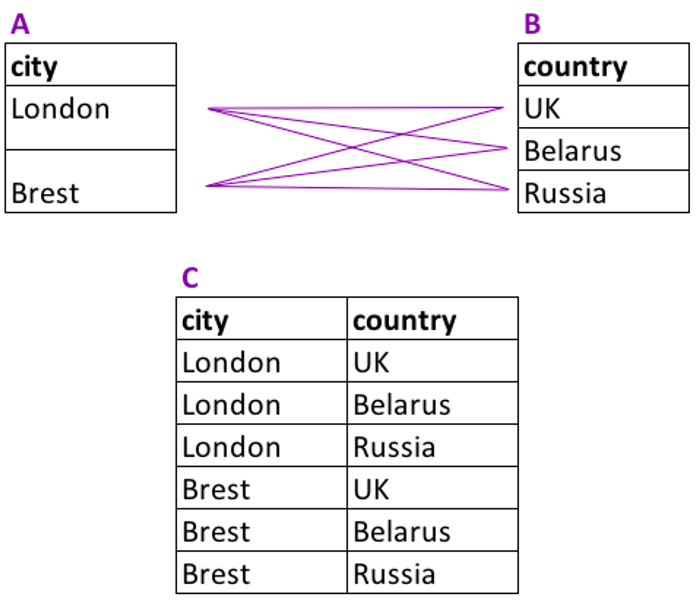
-
- **USING**
- Пример с USING (когда колонки в 2 таблицах называются одинакого)
  ```sql
  SELECT
  	col_1,
  	r.col_2
  FROM database_1.table_name_1 AS l
  INNER JOIN database_2.table_name_2 AS r
  USING(col_1)
  ```
-
- ### UNION
  
  Слияние воедино путем складывания одной таблицы к другой
  
  Пример простого UNION
  ```sql
  SELECT DISTINCT col_1 FROM database_1.table_name_1
  UNION ALL
  SELECT DISTINCT col_1 FROM database_1.table_name_2
  ```
-
- # Типы данных
- Явное преобразование типов
  ```sql
  CAST(column_name AS type)
  ```
- Показать тип
  ```sql
  toTypeName(value)
  ```
-
- ### String
  
  `String` – тип данных для хранения строк произвольной длины.
  
  Методы
- |Метод|Описание|
  |--|--|
  |replaceAll(column_name, ‘old_substring’, ‘new_substring’)|Заменяет подстроку|
- ### Date, datetime и interval
  
  Преобразовать колонку в формат даты
  ```sql
  CAST(column_name AS DATE)
  ```
-
- Методы
  |Метод|Описание|
  |--|--|
  |toMonth(column_name)|Получить месяц|
  |toStartOfMonth(column_name)|Получить первый день месяца|
  |now()|Получить нынешнюю дату и время|
  |yesterday()|Получить вчерашнюю дату|
  |dateDiff(’type_diff’, date_1, date_2)|Разница между датами|
  |toDateOrNull(column_name)|Вернет null в случае отсутствия значения|
- Пример интервала
  ```sql
  SELECT
      INTERVAL 4 DAY as test,
      toTypeName(INTERVAL 4 DAY) as test_type
  ```
-
- ### Int
- **`Int8`** — [-128 : 127]
- **`Int16`** — [-32768 : 32767]
- **`Int32`** — [-2147483648 : 2147483647]
- **`Int64`** — [-9223372036854775808 : 9223372036854775807]
- **`Int128`** — [-170141183460469231731687303715884105728 : 170141183460469231731687303715884105727]
- **`Int256`** — [-57896044618658097711785492504343953926634992332820282019728792003956564819968 : 57896044618658097711785492504343953926634992332820282019728792003956564819967]
- ### Uint
- **`UInt8`** — [0 : 255]
- **`UInt16`** — [0 : 65535]
- **`UInt32`** — [0 : 4294967295]
- **`UInt64`** — [0 : 18446744073709551615]
- **`UInt128`** — [0 : 340282366920938463463374607431768211455]
- **`UInt256`** — [0 : 115792089237316195423570985008687907853269984665640564039457584007913129639935]
- ### Числа с плавающей точкой
  
  Float, Double, Decimal
  
  **Float[32/64]**
  
  `Float` – числа с плавающей запятой. Их использование в ClickHouse не рекомендовано, т.к. можно столкнуться с ошибками округления. В некоторых случаях точность подсчетов может быть критична, например, при работе с большими денежными показателями.
  
  **DECIMAL(P, S)**
  
  `DECIMAL` – тип данных, который используется для хранения дробных чисел и позволяет избежать проблем, которые возникают при использовании Float.
  
  Параметры:
- P (precision, 1:76) – определяет, сколько десятичных знаков может содержать число, включая дробную часть
- S (scale, 0:P) – определяет, сколько десятичных знаков содержится в дробной части числа
- ### NaN, Inf
- ### Коллекции
  
  array
  ```sql
  array('1', '2', '3') -- Пример массива
  
  array('1', '2', '3')[1] -- получить элемент массива
  >> '1' -- Нумерация идет с 1
  ```
- tuple
  ```sql
  tuple('1', '2', '3') -- Пример кортеж
  tuple('1', '2', '3').1 -- получить элемент кортежа
  >> '1' -- Нумерация идет с 1
  ```
- ### Bool
  
  В Click House отсутствует. Вместо этого используется Uint8 (0 or 1)
- ### Nullable(свойство)
  
  Могут хранить null
- ### **orNull**
  
  Для обработки случаев, когда в данных могут встретиться `NULL`, используется дополнение `orNull`
  
  ```sql
  SELECT
    toInt64OrNull('123'),  -- к обычному toInt64 добавляется OrNull
    toInt8OrNull('123$')
  ```
- ### **coalesce**
  
  `coalesce` – слева-направо проверяет являются ли переданные аргументы `NULL` и возвращает первое не `NULL` значение
  
  ```
  SELECT
    coalesce(toInt32OrNull('$435'), null, null, 33, null, 77) as first_non_null
  ```
- ## **geoDistance**
  
  `geoDistance` – функция для работы с координатами, рассчитывающая расстояние между двумя точками в метрах.
  
  Параметры:
- `lon1Deg` — долгота первой точки в градусах
- `lat1Deg` — широта первой точки в градусах
- `lon2Deg` — долгота второй точки в градусах
- `lat2Deg` — широта второй точки в градусах
  
  Все значения долготы должны быть в диапазоне [-180°, 180°], широты – [-90°, 90°].
  
  ```sql
  SELECT
    -- lon1Deg, lat1Deg, lon2Deg, lat2Deg
    geoDistance(0.1278, 51.5074, 30.3609, 59.9311) AS dist_m,
    dist_m / 1000 AS dist_km
  ```
- ## Подзапросы
  
  ```sql
  -- Подзапрос
  SELECT
  *
  FROM (
  SELECT
  *
  FROM (
  ...
  )
  )
  
  -- Подзапрос при join
  SELECT
  *
  FROM () AS table_l
  INNER JOIN () AS table_r
  USING(column_name)
  ```
- ## Создание таблиц
  
  `View` - Представление. Хранит в себе инструкцию по созданию таблицы, а не саму таблицу. Собирает данные каждый раз при вызове
  
  `MATERIALIZED VIEW` - Хранит с себе данные, а не инструкции
  
  Создание MATERIALIZED VIEW
  ```sql
  CREATE VIEW schema.table_name AS (
  SELECT
  *
  FROM old_table
  WHERE a = b
  )
  
  -- Писал по инструкции для Click House
  ```
  
  ```sql
  CREATE MATERIALIZED VIEW schema.table_name ENGINE = Log POPULATE AS (
  SELECT
  *
  FROM old_table
  WHERE a = b
  )
  
  -- Писал по инструкции для Click House
  -- POPULATE - Сразу заполнить данные
  ```
  
  `WITH` - ключевое слово используется для создания временных подзапросов, которые могут быть использованы в основном запросе. Результаты подзапросов не сохраняются на диске и вычисляются при выполнении основного запроса.
  
  Результат из with пробрасывается в другой запрос
  ```sql
  WITH
  (SELECT AVG(column_name) AS new_value FROM schema.table_name_1) AS new_column_with
  
  SELECT
  column_one,
  new_column_with
  FROM schema.table_name_2
  ```
  
  Внутри with преобразуем колонку из следующего запроса
  ```sql
  WITH
  column_old * 0.87 AS new_column_with
  
  SELECT
  column_old,
  new_column_with
  FROM schema.table_name
  ```
  
  Добавляем свою колонку со значением
  ```sql
  WITH
  'my text' as new_column_with
  SELECT
  column_one,
  new_column_with
  FROM schema.table_name
  ```
  
  `table`
  
  Создание пустой таблицы Click House
  ```sql
  CREATE TABLE users (
  Id UInt32,
  name String
  ) ENGINE = Log
  ```
  
  Создать таблицу со структурой старой таблицы
  ```sql
  CREATE TABLE users AS old_users
  ```
  
  ```sql
  CREATE TABLE users AS ENGINE = Log (
  SELECT
  *
  FROM old_table
  )
  ```
  
  Создать таблицу со структурой и данными старой таблицы
  
  Если таблица еще не создана, создать таблицу table_name в базе database_name
  ```sql
  CREATE TABLE IF NOT EXISTS database_name.table_name ( 
    column_1 UInt32, -- колонка, тип данных
    column_2 UInt32,
    column_3 DateTime('Europe/Moscow'),
    column_4 String
  ) 
  
  ENGINE = MergeTree -- движок
  ORDER BY (column_1, column_2)
  ```
- ## Удалить таблицу
  
  ```sql
  DROP TABLE schema.table_name
  ```
- ## Заполнить таблицу
  
  Заполнить таблицу своими значениями
  ```sql
  INSERT INTO users (name, bio, birth, email) VALUES ('Макс', 'Красава', '1997-09-06', 'makscum@fmail.com');
  -- Можно сразу несколько
  INSERT INTO users (name, bio, birth, email) 
  VALUES 
  	('Макс', 'Красава', '1997-09-06', 'makscum@fmail.com')
  	('Валера', 'Красава', '1997-09-06', 'makscum@fmail.com')
  	('Инна', 'Красава', '1997-09-06', 'makscum@fmail.com')
  
  -- В Click House
  INSERT INTO users
  SELECT
  	123 AS id,
  	'maks' AS name
  ```
- Заполнить таблицу значениями из другой таблицы
  ```sql
  INSERT INTO users
  SELECT
  user_id,
  user_name
  FROM old_user
  ```
- ## Редактировать таблицу
  
  В Click House движок должен быть MergeTree
  
  Создать новую колонку
  ```sql
  ALTER TABLE schema.table_name ADD COLUMN new_column String AFTER column_t
  
  -- AFTER - колонка после которой будет находиться новая колонка
  ```
  
  Поменять тип колонки
  ```sql
  ALTER TABLE schema.table_name MODIFY COLUMN new_column UInt32
  ```
  
  Удалить колонку
  ```sql
  ALTER TABLE schema.table_name DROP COLUMN new_column
  ```
  
  Удалить строки по условию
  ```sql
  ALTER TABLE schema.table_name DELETE WHERE column_name = 0
  ```
  
  Изменить данные в колонке
  ```sql
  ALTER TABLE schema.table_name UPDATE column_name = column_name * 2 WHERE Platform = 'ios'
  ```
- ## Условные операторы
  
  ```sql
  SELECT 
    CASE
        -- если значение в column_1 больше, чем в column_2, в новый столбец будет записана единичка
        WHEN column_1 > column_2 THEN 1 
        -- если значение в column_1 меньше, чем в column_2, в новый столбец будет записана двойка
        WHEN column_1 < column_2 THEN 2
        -- во всех остальных случаях – тройка
        ELSE 3
    END AS cond_1 -- END – завершаем конструкцию, а новый столбец называем cond_1
  FROM
    table
  ```
- ## Оконные функции
  
  Задачи, которые непринужденно решаются с помощью оконных функций в SQL:
- Ранжирование (всевозможные рейтинги).
- Сравнение со смещением (соседние элементы и границы).
- Агрегация (сумма и среднее).
- Скользящие агрегаты (сумма и среднее в динамике).
  
  ```sql
  SELECT
    city,
    date,
    revenue,
    SUM(revenue) OVER w AS revenue_sum
  FROM 
    data
  WINDOW w AS (
    PARTITION BY city
    ORDER BY date ASC
    ROWS BETWEEN UNBOUNDED PRECEDING AND CURRENT ROW
  )
  ORDER BY
    city ASC,
    date ASC
  ```
  
  В данном запросе мы объявили окно с помощью функции `OVER` в блоке `FROM`, передав в нее следующие параметры:
- `PARTITION BY city` – означает, что мы хотим работать с городами как с отдельными разделами, то есть сделать разбивку по городу;
- `ORDER BY date ASC` – когда мы создали окно для каждого города, мы хотим отсортировать строчки в таком окне по возрастанию даты;
- `ROWS BETWEEN UNBOUNDED PRECEDING AND CURRENT ROW` – означает, что мы хотим, чтобы для каждой строки внутри города в окно попадала таблица от начала окна до текущей строки. Иными словами, для первой строки это будет только одна строка, для второй это будет первая и вторая, для третьей это будет первая + вторая + третья, и так далее. Порядок строк задается выше параметром `ORDER BY`.
  
  Далее, с помощью этого окна, для каждого города и для каждой строчки мы имеем диапазон дат от начала периода до текущей даты, и по этому окну мы делаем сумму. Таким образом, на каждый день для каждого города у нас получается накопительная сумма.
  
  Выше мы описывали окно в блоке `FROM`, и потом вызывали его в блоке `SELECT`. Существует возможность вызова окна сразу в блоке `SELECT`, без его именования:
  
  ```sql
  SELECT
    id,
    section,
    header,
    score,
    row_number() OVER ()  AS num -- создаем колонку с номером строки
  FROM news;
  ```
  
  ```
  +----+---------+-----------+-------+-----+
  | id | section |  header   | score | num |
  +----+---------+-----------+-------+-----+
  |  1 |       2 | Заголовок |    23 |   1 |
  |  2 |       1 | Заголовок |     6 |   2 |
  |  3 |       4 | Заголовок |    79 |   3 |
  |  4 |       3 | Заголовок |    36 |   4 |
  |  5 |       2 | Заголовок |    34 |   5 |
  |  6 |       2 | Заголовок |    95 |   6 |
  |  7 |       4 | Заголовок |    26 |   7 |
  |  8 |       3 | Заголовок |    36 |   8 |
  +----+---------+-----------+-------+-----+
  ```
  
  При создании окна ему можно передать следующие параметры:
- `PARTITION BY [city]`
- `ORDER BY [date ASC]`
- `ROWS [BETWEEN UNBOUNDED PRECEDING AND CURRENT ROW]`
- ## **Границы фрейма**
  
  – `UNBOUNDED PRECEDING` – указывает, что окно начинается с первой строки секции
  
  – `UNBOUNDED FOLLOWING` – указывает, что окно заканчивается на последней строке секции
  
  `rows between X preceding and Y following` - указать количество строк в окне от текущей
  
  Где `X` — количество строк перед текущей, а `Y` — количество строк после текущей:
  
  `rows between 1 preceding and 1 following` - сдвиг на одну строчку вверх и одну вниз
  
  `current row` — это значит «текущая запись»
  
  Все типы фреймов — rows, groups и range — используют одни и те же инструкции, чтобы задать границы:
- unbounded preceding / following,
- N preceding / following,
- current row.
  
  Но трактовка этих инструкций может отличаться в зависимости от типа фрейма.
  
  Инструкции `unbounded preceding` и `unbounded following` всегда означают границы секции:
- 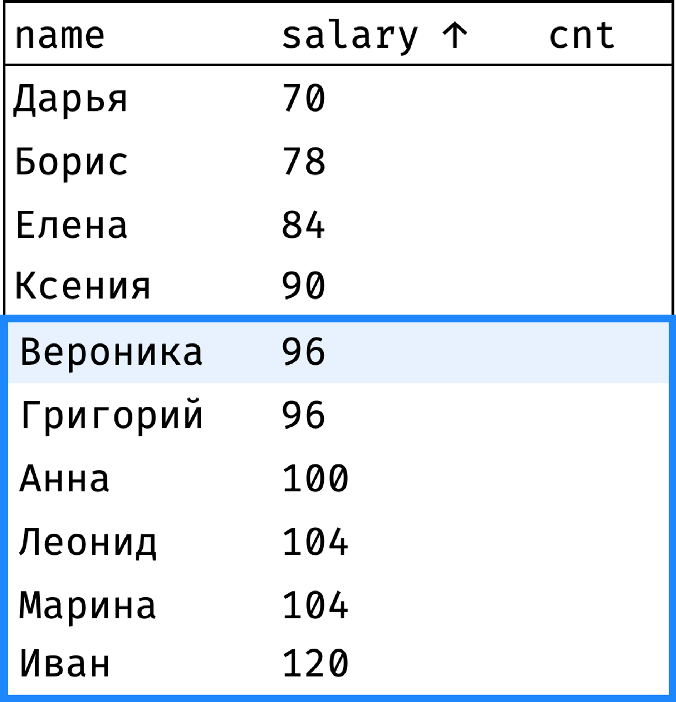{:height 264, :width 261}**ROWS**, unbounded following
- {:height 305, :width 262}**GROUPS**, unbounded following
- {:height 295, :width 265}**RANGE**, unbounded following
- `current row` для строковых фреймов означает текущую запись, а для груповых и диапазонных — текущую запись и все равные ей (по значениям из order by):
- 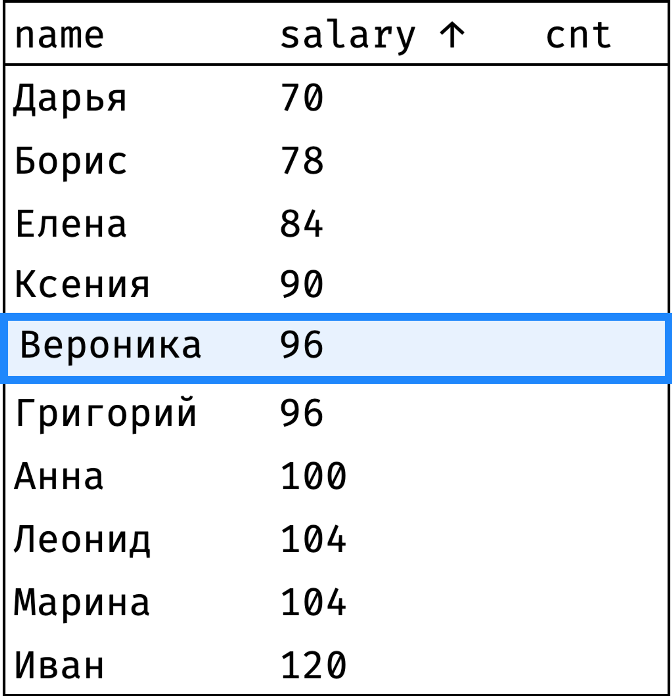{:height 307, :width 273} **ROWS**, current row
- 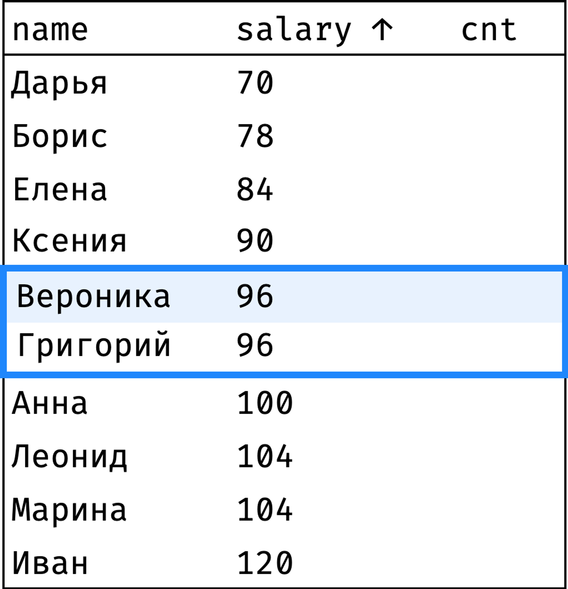{:height 341, :width 283} **GROUPS**, current row
- {:height 324, :width 286} **RANGE**, current row
- `N preceding` и `N following` означают:
	- для строковых фреймов — количество записей до / после текущей;
	- для групповых фреймов — количество групп до / после текущей;
	- для диапазонных фреймов — диапазон значений относительно текущей записи.
- 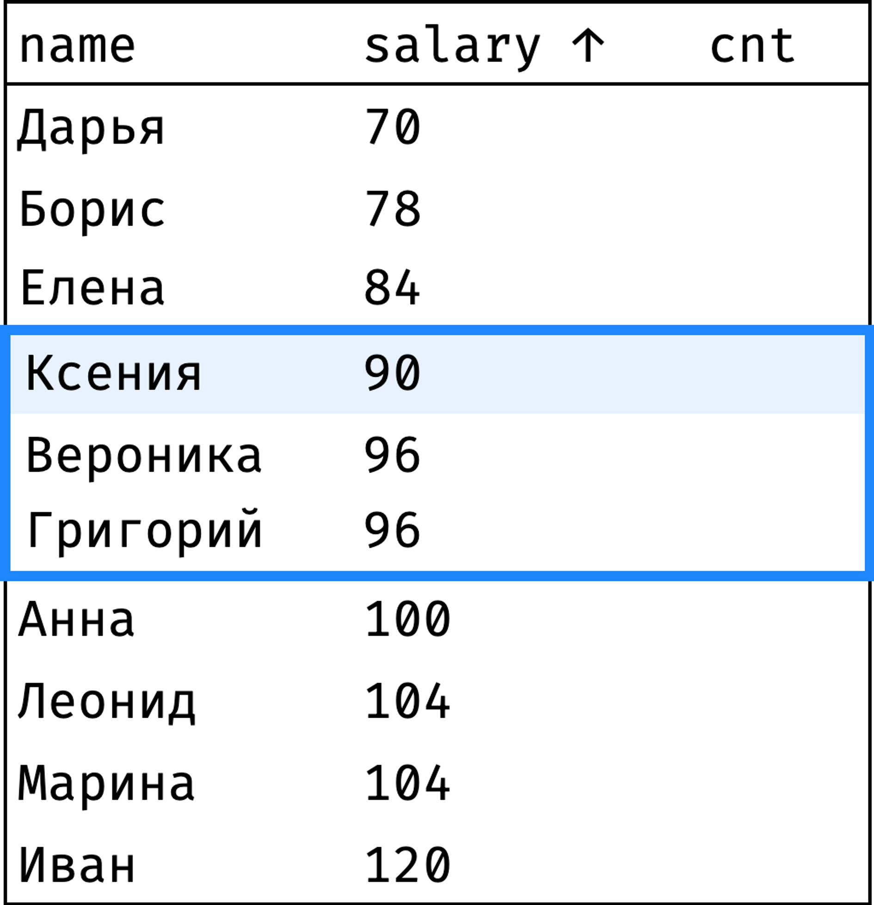{:height 293, :width 265} **ROWS**, 2 following
- 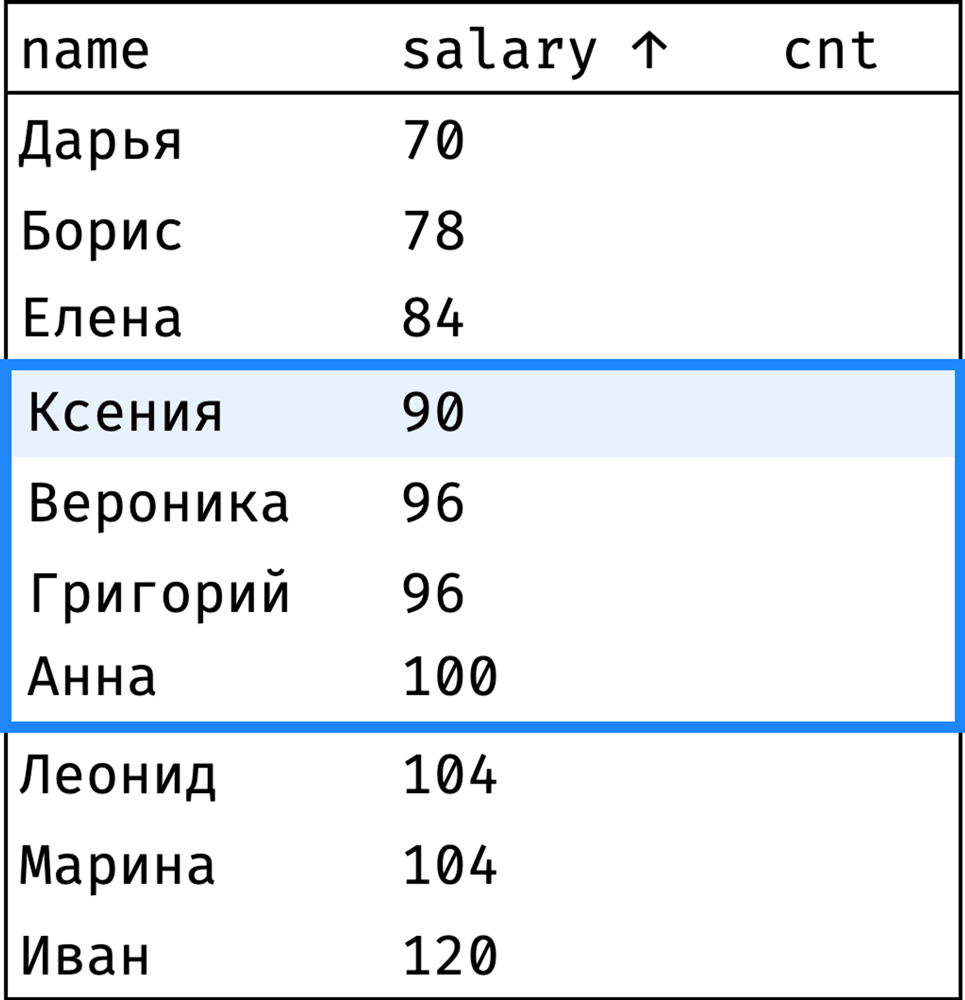{:height 301, :width 274} **GROUPS**, 2 following
- 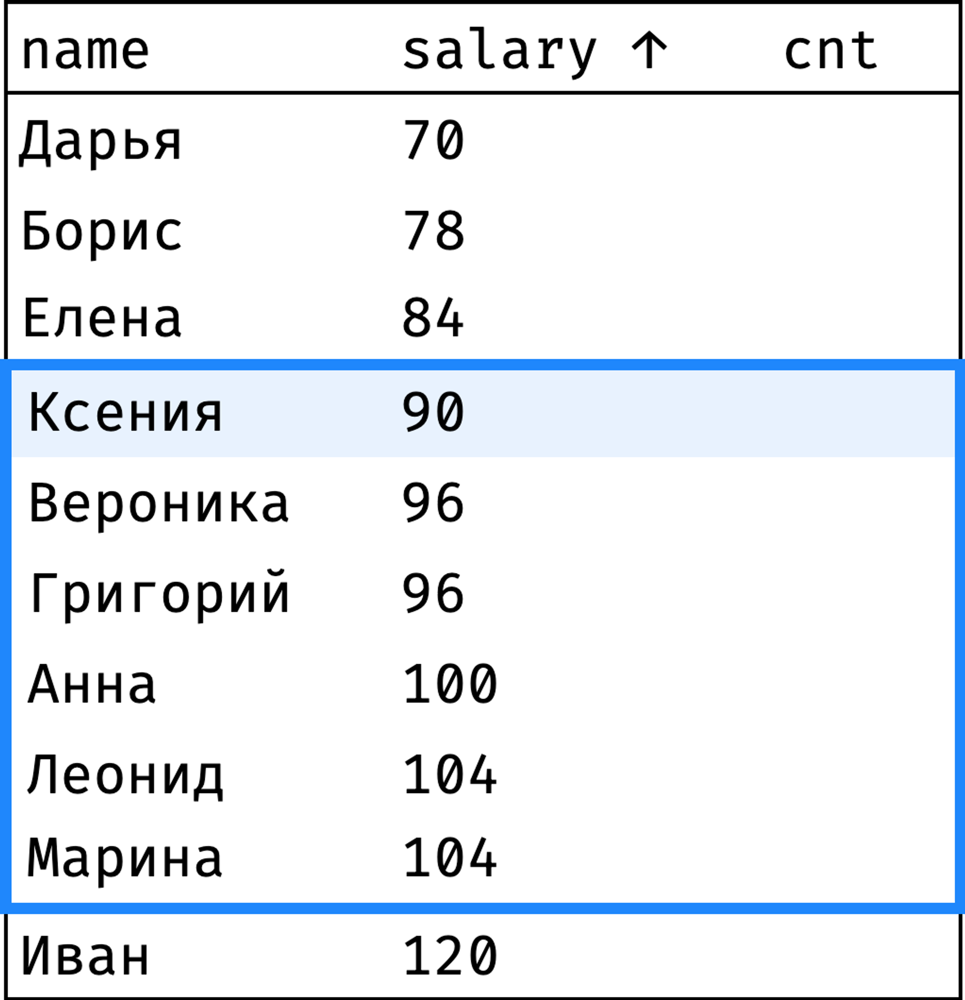{:height 274, :width 280} **RANGE**, 15 following
-
- ## **PARTITION BY**
  
  Группирует строки запроса в разделы, которые потом обрабатываются оконной функцией независимо друг от друга. Работает аналогично блоку `GROUP BY` в запросе, только группирует данные для окна.
  
  ---
- ## **ORDER BY**
  
  Сортирует результаты внутри раздела, тем самым определяя порядок, в котором оконная функция будет работать со строками. Работает аналогично блоку `ORDER BY` на уровне запроса.
  
  ---
- ## **ROWS/RANGE/GROUPS**
  
  Задает параметры рамки окна. Рамки используются в тех оконных функциях, которые работают с рамками, а не с разделом целиком. Первым аргументом задается начало рамки, вторым аргументом конец рамки, и дополнительно, третьим аргументом задается исключение из рамки.
  
  Рамку можно задать в нескольких режимах, а именно:
- `ROWS` – Начало и конец рамки задаются в строках относительно текущей строки. Например `ROWS BETWEEN 3 PRECEDING AND 3 FOLLOWING` означает создание рамки на 3 строки вверх и вниз относительно текущей строки.
- `RANGE` – Начало и конец рамки задаются в разнице значений столбца из `ORDER BY`. Например, если в `ORDER BY` находится столбец `event_date` с типом данных date, то определение окна можно задать следующим образом `RANGE BETWEEN '3 day' PRECEDING AND '3 days' FOLLOWING` что будет означать рамку на 3 дня назад и вперед.
- `GROUPS` - Бегает не внутри группы, а по группам
  
  Группа включает все строки с одинаковым значением столбцов из order by
  
  Инструкции для границ группового фрейма используются такие же, как для строкового, но смысл их отличается:
	- `current row` — текущая группа (а не текущая строка);
	- `N preceding / following` — N-я группа относительно текущей (а не N-я строка);
	- `unbounded preceding / following` — граница секции (как у строкового фрейма).
	  
	  При указании рамки через `RANGE` обязательным условием является только один столбец в `ORDER BY` окна.
	  
	  Любые агрегатные функции можно использовать с помощью окна. Это необходимо делать явно с указанием `OVER` и имени окна. Например `AVG(revenue) OVER w AS avg_revenue`
	  
	  Помимо обычных агрегатных функций, существуют специальные функции для работы через окно.
- `ROW_NUMBER()`– порядковый номер строки, начинается с 1
- `DENSE_RANK()`- считает ранг по указанному окну
- `RANK()` - тоже ранг, но с пропусками
	- То есть, если номер уже занят, например два 4, то после 4 будет 6
- `CUME_DIST()` - считает процент записей, у которых значение столбца из order by ≤ текущему
	- Количество записей ≤ текущей / общее количество записей
	- Располагает записи в порядке, указанном в order by окна (в нашем случае — по возрастанию зарплаты).
	- Находит текущую запись в общем ряду (зарплату текущего сотрудника среди всех зарплат).
	- Считает, сколько записей ≤ текущей по значению столбца из order by (сколько людей получают такую же или меньшую зарплату).
	- Делит на общее количество записей (на количество сотрудников).
- `PERCENT_RANK()` - считает процент записей, у которых значение столбца из order by < текущего (исключая текущую запись)
- `NTILE(num)` - разбить таблицу на num групп и проставить номер
- `LAG(my_field, 1)` – получить значение столбца `my_field` из предыдущей строки
- `LEAD(my_field, 1)` – получить значение столбца `my_field` из следующей строки
- `FIRST_VALUE(column_name)` - достать первое значение в окне
	- Окно идет по фрейму. То есть фрейм берет первую строку и расширяется с каждой строкой
	- Нужно самому задавать размер окна
- `LAST_VALUE(column_name)` - достать последнее значение в окне
	- Окно идет по фрейму. То есть фрейм берет первую строку и расширяется с каждой строкой
- `NTH_VALUE(column_value, num)`- достать num значение в окне
	- Окно идет по фрейму. То есть фрейм берет первую строку и расширяется с каждой строкой
- `percentile_disc(PERCENT) within group (order by COLUMN) over (partition by OTHER_COLUMNS)` - Перцентиль (работает далеко не во всех БД)
- ## EXCLUDE
  
  Исключение определенных записей
  
  Исключить текущую строку
  ```sql
  window w as (
  rows between unbounded preceding and unbounded following
  exclude current row
  )
  
  -- Пример подсчета среднего исключая текущую строку
  select
  name, salary,
  round(avg(salary) over w) as "avg"
  from employees
  window w as (
  rows between unbounded preceding and unbounded following
  exclude current row
  )
  order by salary, id;
  ```
- ### Виды  `EXCLUDE`
- `EXCLUDE NO OTHERS`. Ничего не исключать. Вариант по умолчанию: если явно не указать exclude, сработает именно он.
- `EXCLUDE CURRENT ROW`. Исключить текущую запись (как мы сделали на предыдущем шаге с сотрудником).
- `EXCLUDE GROUP`. Исключить текущую запись и все равные ей (по значению столбцов из order by).
- `EXCLUDE TIES`. Оставить текущую запись, но исключить равные ей.
-
- 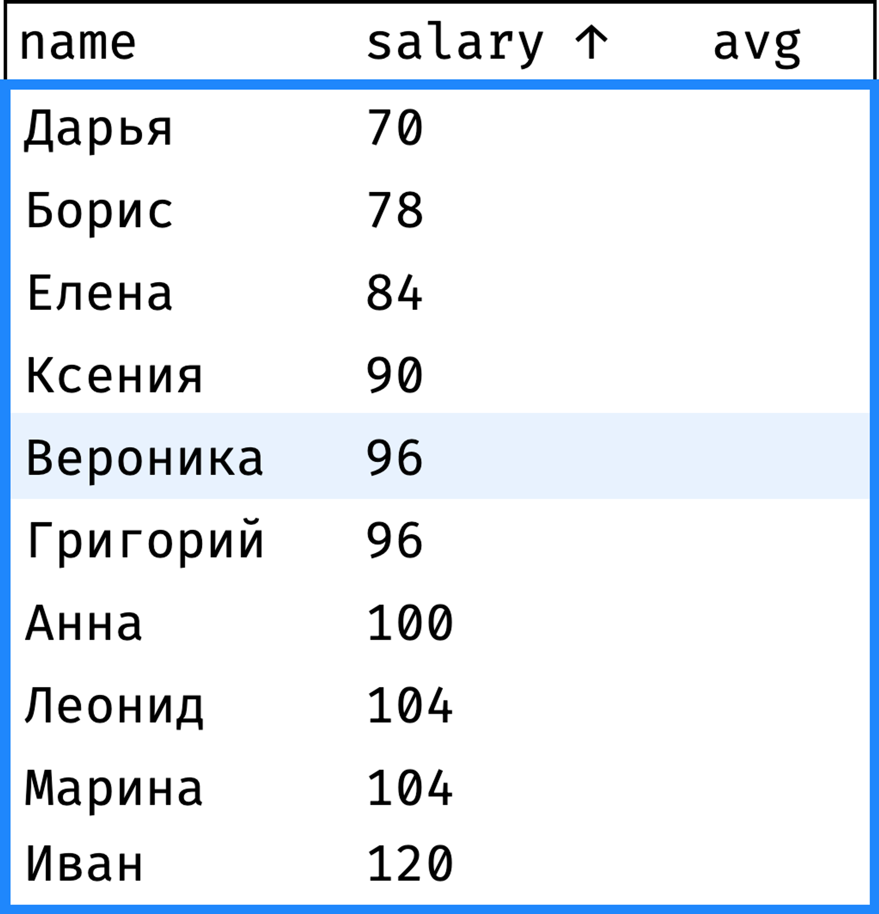{:height 296, :width 275} NO THERS
- 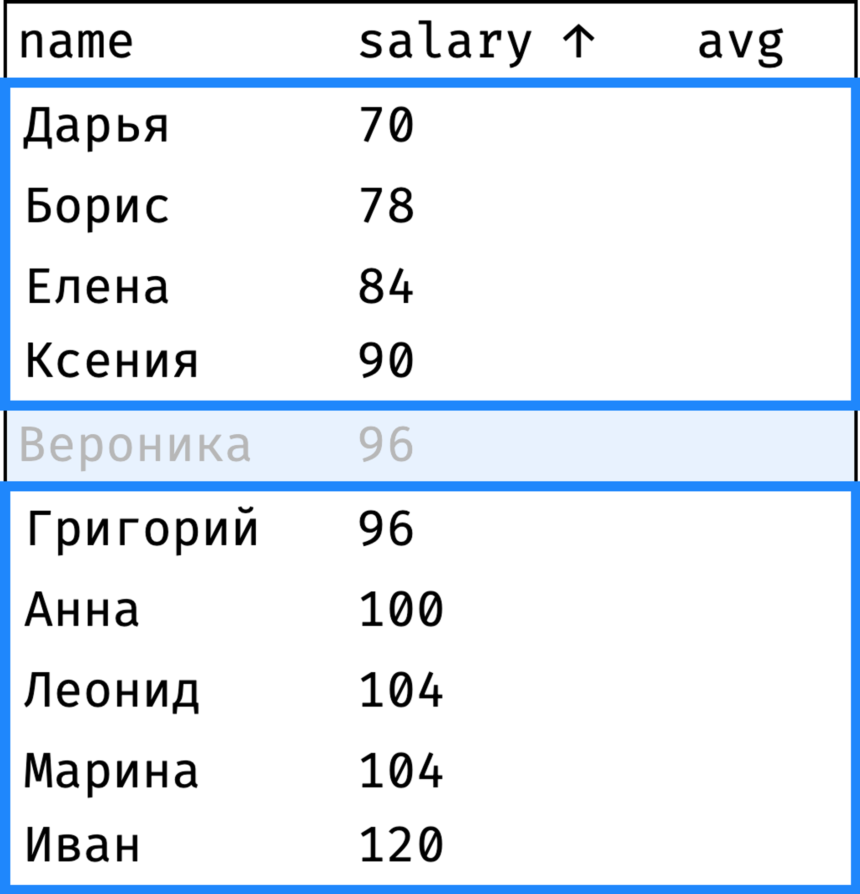{:height 313, :width 278} CURRENT ROW
- 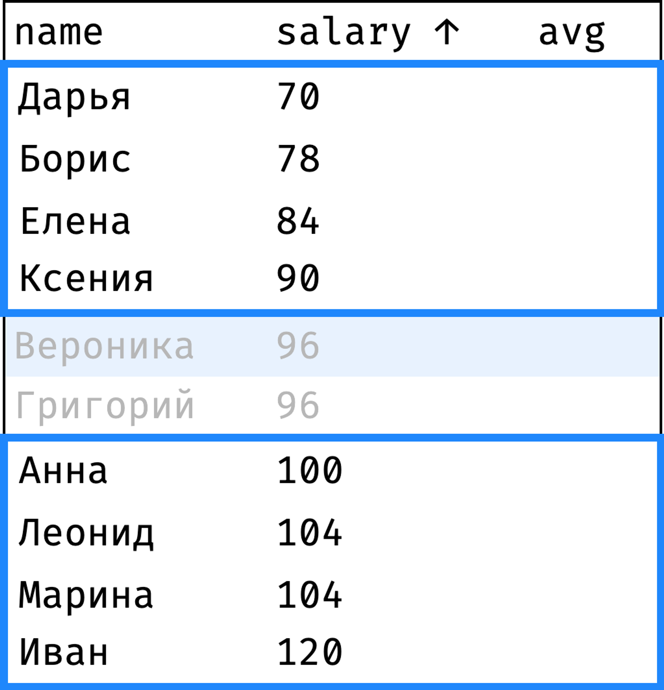{:height 320, :width 280} GROUPS
- 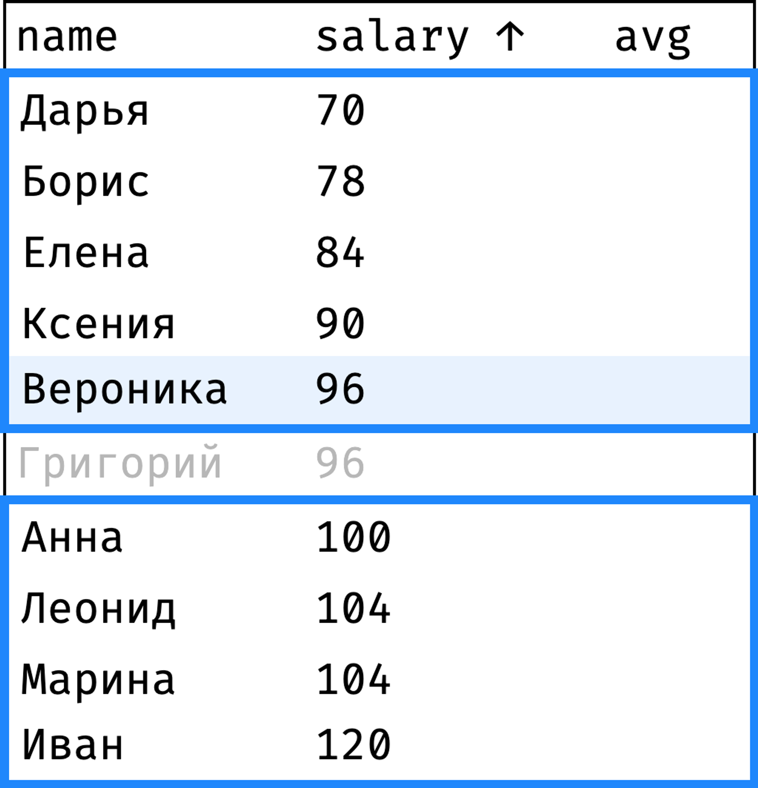{:height 306, :width 289} TIES
-
- ## FILTER
  
  `FILTER` работает как обычное условие WHERE, но фильтрует не все записи запроса, а только фрейм для конкретной оконной функции.
  
  ```sql
  select
  ...
  sum(salary*1.5)
    filter(where department <> 'it')
    over () as "+50% без ИТ"
  from employees
  order by id;
  ```
- ### **`CASE` как альтернатива `FILTER`**
  
  ```sql
  select
  ...
  sum(
    case when department = 'it' then salary else salary*1.1 end
  ) over w as "+10% кроме ИТ"
  from employees
  order by id;
  ```
- ### **Порядок построения запроса**
  
  ```
  SELECT 
    [column_1], 
    [column_2],
    [window_function](CASE) OVER [window_name]
  FROM 
    [table_name]
  WHERE 
    [...]
  GROUP BY 
    [...]
  HAVING 
    [...]
  WINDOW [window_name] AS (
    PARTITION BY [...]
    ORDER BY [...]
    [window_frame])
  EXCLUDE
  ORDER BY 
    [...]
  LIMIT []
  ```
  
  Несколько примеров:
  
  ```sql
  SELECT 
    country, 
    city,
    rank() OVER country_sold_avg
  FROM 
    sales
  WHERE 
    month BETWEEN 1 AND 6
  GROUP BY 
    country, 
    city
  HAVING 
    sum(sold) > 10000
  WINDOW 
    country_sold_avg AS (
        PARTITION BY country
        ORDER BY avg(sold) DESC
    )
  ORDER BY 
    country, 
    city
  
  SELECT 
    city, 
    month,
    sum(sold) OVER (
        PARTITION BY city
        ORDER BY month
        RANGE UNBOUNDED PRECEDING
  ) total
  FROM
    sales
  ```
- ### План выполнения запроса
  
  ```sql
  FROM (выбор таблицы)
  JOIN (комбинация с подходящими по условию данными из других таблиц)
  WHERE (фильтрация строк)
  GROUP BY (агрегирование данных)
  HAVING (фильтрация агрегированных данных)
  SELECT (возврат результирующего датасета)
  ORDER BY (сортировка).
  ```
- ## Кластеризация
  
  При анализе данных бывает удобно разбить датасет на группы близких значений. Частный случай такой задачи — поиск *островов* в данных (islands).
- Пример создания островов значений
	- ```sql
	  with ngroups as (
	    select
	      num,
	      num - row_number() over w as group_id
	    from numbers
	    window w as (order by num)
	  )
	  select
	    min(num) as n_start,
	    max(num) as n_end,
	    count(*) as n_count
	  from ngroups
	  group by group_id;
	  ```
	- 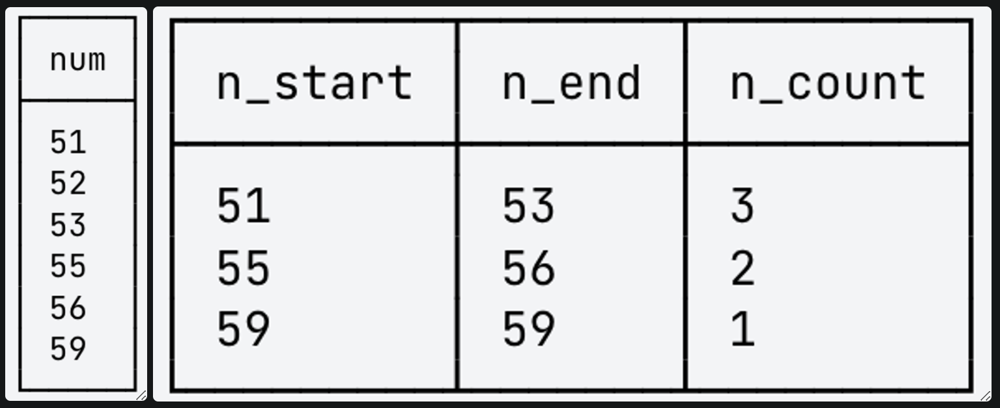
-
- ### **Кластеры значений**
  
  Значения с небольшой разницей
  
  Универсальный алгоритм поиска кластеров на SQL:
- Посчитать расстояние `L` между соседними значениями через `lag()`.
- Идентифицировать границы по условию `sum(case when L > N then 1 else 0 end)`, где `N` — максимально допустимое расстояние между соседними значениями кластера.
- Агрегировать кластеры по идентификатору.
  
  Острова можно было считать по этому же алгоритму. Но там мы «срезали путь» через ранжирование, потому что точно знали, что соседние значения отличаются ровно на 1.