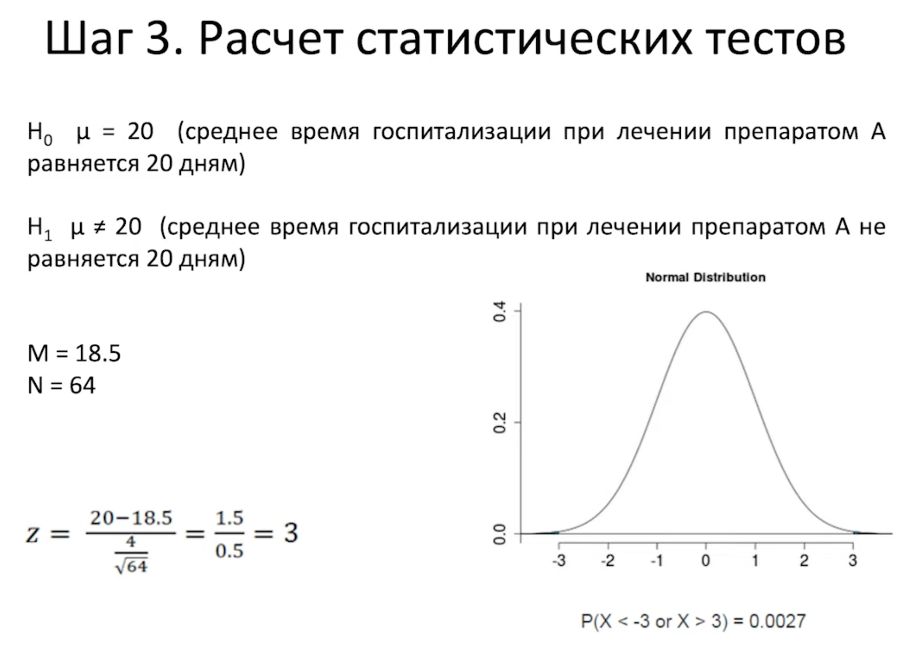

public:: true

- [Ноутбук Санька](https://www.kaggle.com/code/alexkovyaz/ab-test-experiment/notebook)
- # Термины
- #DAU (daily active users) – число уникальных пользователей за день
- #WAU (weekly active users) – число уникальных пользователей за неделю
- #MAU (monthly active users) – число уникальных пользователей за месяц
- #AOV (average order value) - средняя сумма заказа
- #CR (Converted Rate) - процент реализованных событий
- #CTR - кол-во кликов/кол-во просмотров
- #ARPU - средний доход с одного пользователя
- #RPPU - средний доход с одного платящего пользователя
- #MAPE - Средняя абсолютная ошибка в процентах
- #MAE - Средняя абсолютная ошибка
- #CTA - Стоимость привлечения
- #CPC  – (cost-per-click)стоимость за клик пользователя по объявлению. Рассчитывается путём деления суммы потраченных денег на общее число кликов
  
  `Континуальная переменная`- это переменная, которая может принимать любое значение в определенном диапазоне. Например, возраст, рост, вес и время являются континуальными переменными, так как они могут принимать любое значение в определенном диапазоне и могут быть измерены с любой степенью точности. В статистике и научных исследованиях континуальные переменные обычно измеряются с помощью дробных чисел или десятичных дробей.
- # Теория вероятности
  
  Вероятность - P
  
  P лежит в диапазоне от 0 до 1
  
  n - количество положительных исходов
  
  m - количество всех исходов
  
  P = n/m
- ## **Умножение вероятностей**
  
  Также это можно выразить как "вероятность того, что случится событие 1 **И** событие 2". Чаще всего такое делают с **независимыми событиями** — когда одно событие **не меняет** вероятность другого события.
- ## **Сложение вероятностей**
  
  Также у нас бывают **зависимые** события — когда возникновение одного события меняет вероятность другого. Крайний случай зависимых событий — **взаимоисключающие события**, ****и вероятности таких событий допустимо просто складывать. Это также называется **полным набором событий** и может быть выражено как "вероятность того что случится событие 1 **ИЛИ** событие 2".
- ## Формула Бернули
  
  [https://habr.com/ru/articles/331060/](https://habr.com/ru/articles/331060/)
  
  Типичная задачка на собеседовании: "мы кинули монетку n раз, орел выпал из них k раз — какова вероятность этого события?". Если и n, и k не очень большие, то эта задача решается методом грубой силы:
- Выписываем все возможные сочетания орлов и решек
- Считаем те варианты, которые подходят под наш запрос (k орлов, n-k решек)
- Делим результат на количество всех возможных вариантов
  
  Масштабируемость этого варианта, откровенно говоря, оставляет желать лучшего. К счастью, существует специальная формула, позволяющая считать эту величину гораздо быстрее:
- {:height 62, :width 191}
- p — вероятность первого события
- q — вероятность второго события
- n — общее число испытаний (бросков монетки)
  k - число интересующих нас событий (бросков орла)
- `*Cnk*` — биномиальный коэффициент:
  {:height 130, :width 186}
- ! — это знак факториала.
  
  Считается как произведение всех чисел от 1 до того, которое стоит перед факториалом (например, 3! = 1*2*3).
  
  ```python
  def bernul(n: int, p: float, k: int) -> float:
      """
          p — вероятность события
          n — общее число испытаний
          k - число интересующих нас событий
      """
      return special.comb(n, k)*p**k*(1 - p)**(n - k)
  ```
- ## **Формула Байеса**
  
  `*P*(*Y*∣*X*)=*P*(*X*)*P*(*Y*)/*P*(*X*∣*Y*)`
  
  `*P*(*Y*)` и `*P*(*X*)` - это вероятности событий Y и X, соответственно.
  
  `*P*(*Y*∣*X*)` - вероятность события Y, **если наступило событие X**
  
  `*P*(*X*∣*Y*)` - вероятность события X, **если наступило событие Y**
  
  Очень важно не путать `*P*(*Y*∣*X*)` и `*P*(*X*∣*Y*)`! Они кажутся похожими, но очень редко совпадают в реальной жизни. Скажем, если с вами рядом летает комар, то довольно высока вероятность получить укус — **P(получить укус|рядом комар)**. Но если вы получили укус, то это необязательно сделал именно комар — вас могли укусить любая другая двукрылая пакость, собака, змея или излишне любвеобильный партнёр — **P(рядом комар|получить укус)**.
  
  ---
  
  **Пример из лекции**
  
  У нас есть две группы стрелков из лука — одна из профессионалов (`*Y*1`), другая из новичков (`*Y*2`). Допустим, профессионалов 5, и их точность попадания — 8 из 10 мишеней. Новичков же 15, и их точность — 4 из 10 мишеней.
  
  Мы подошли к мишени и увидели, что в неё попали. Какова вероятность, что это попадание сделал профессионал?
  
  Для начала подсчитаем вероятность того, что случайно выбранный стрелок принадлежит к группе профессионалов:
  
  `*P*(*Y*1)=5/20=0.25`
  
  Вероятность попадания профессионала в мишень нам уже известна:
  
  `*P*(*X*∣*Y*1)=0.8`
  
  Теперь рассчитаем вероятность попадания в мишень в целом:
  
  `*P*(*X*)=*P*(*Y*1)*P*(*X*∣*Y*1)+*P*(*Y*2)*P*(*X*∣*Y*2)=0.25∗0.8+0.75∗0.4=0.5`
  
  Обратите внимание, что формула выше легко приводится к уже знакомой нам формуле `*P*=*m/n*`:
  
  `*P*(*Y*1)*P*(*X*∣*Y*1)+*P*(*Y*2)*P*(*X*∣*Y*2)*P*(*Y*1)*P*(*X*∣*Y*1)`
  
  В итоге у нас получается такая вероятность:
  
  `*P*(*Y*1∣*X*)=*P*(*X*)*P*(*Y*1)*P*(*X*∣*Y*1)=0.50.25∗0.8=0.4`
- ## **Генеральная совокупность**
  
  **Генеральная совокупность** – совокупность всех объектов (единиц), относительно которых предполагается делать выводы при изучении конкретной задачи.
  
  *Пример: уровень тестостерона всех мужчин, участвующих в Олимпийских играх*
  
  Зачастую очень сложно исследовать все объекты, поэтому из генеральной совокупности берут выборки.
  
  Важной характеристикой выборки является её репрезентативность. Под этим термином понимается соответствие характеристик выборки характеристикам генеральной совокупности в целом.
- ## **Виды выборок**
  
  **1. Вероятностные выборки** — при создании таких выборок мы предполагаем, что генеральная совокупность  однородна и все её элементы одинаково доступны.
  
  *Простая случайная выборка* (simple random sample) – случайный набор объектов из генеральной совокупности. Пример: 100 мужчин, участвующих в Олимпийских играх
  
  *Стратифицированная выборка* (stratified sample) – перед тем, как случайным образом отобрать объекты из генеральной совокупности, мы разбиваем её на несколько страт (групп). Пример: мужчины 18-25 лет, 26-31, 32-36 и так далее. Потом уже из этих групп случайно набираем по N человек.
  
  *Групповая выборка (cluster sample)* – сначала делим генеральную совокупность на кластеры, только считаем, что они между собой схожи. Пример: рост жителей Санкт-Петербурга. Мы делим их на районы (Адмиралтейский, Василеостровский и т.д), а потом случайно набираем людей из нескольких случайно выбранных районов для исследования.
  
  **2. Невероятностные выборки** — отбор в такой выборке осуществляется не по принципам случайности, а по субъективным критериям – доступности объектов, типичности или равного представительства. Такие выборки часто встречаются в социологических исследованиях, однако полученные на них данные обладают меньшей достоверностью и лучше их обходить стороной.
  
  *Метод снежного кома* — у каждого респондента, начиная с первого, просятся контакты его друзей, коллег, знакомых, которые подходили бы под условия отбора и могли бы принять участие в исследовании.  Основная проблема такой выборки — затрагивается не случайная группа лиц, а лица, связанные общими интересами, хобби и т.д.
  
  *Стихийная выборка* — производится опрос наиболее доступных респондентов. Размер и состав стихийных выборок заранее не известен и определяется только одним параметром - активностью респондентов. Пример: опрос, проведенный в газете или журнале, большинство интернет-опросов
  
  *Выборка типичных случаев* — происходит отбор отдельных единиц генеральной совокупности, которые обладают типичным значением признака (часто это среднее значение). При этом возникает проблема выбора признака и определения его типичного значения.
- ## Переменные в статистике
  
  `Количественные/дискретные` - отвечает на вопрос “сколько?”
  
  `Качественные/номинативные` - отвечает на вопрос “какие?”
  
  `Непрерывные` - могут принимать любое значение в определенном диапазоне. Они могут быть представлены дробными числами.
  
  `Ранговые/порядковые` - результат ранжирования
- {:height 123, :width 344}
- Если в описании данных сказано, что это какая-то отдельная категория, то данные номинативные
- Если при этом в этих категориях можно увидеть явный прирост либо падение - то это порядковые данные
- Если данные выражены числами через точку, то это наверняка непрерывные данные
- В остальных случаях данные можно считать дискретными
  
  **`Мода (mode)`** – значение измеряемого признака, которое встречается максимально часто. Мод может быть несколько
  
  **`Среднее (mean, среднее арифметическое)`** – сумма всех значений измеренного признака, деленная на количество измеренных значений.
  
  $X‾=x1+x2+⋯+xnn\overline{X}=\frac{x_1+x_2+\dots+x_n}{n}X=nx1+x2+⋯+xn$
  
  $\overline{X}$ - среднее выборки
  
  M - среднее генеральной совокупности
  
  Свойства среднего значения:
- $Mx+c=Mx+cM_{x+c} = M_x + cMx+c=Mx+c$
- $Mx∗c=Mx∗cM_{x*c} = M_x * cMx∗c=Mx∗c$
- $∑(xi−Mx)=0\sum(x_i-M_x)=0∑(xi−Mx)=0 ←$ сумма всех отклонений от среднего равняется нулю
  
  *Когда не стоит использовать среднее значение, а лучше брать моду или медиану:*
- явная ассиметрия
- заметные выбросы
- несколько мод
  
  **`Медиана (median)`** – значение признака, которое делит упорядоченное множество данных пополам. Берем множество значений признака, сортируем и берем центральное значение.
  
  Это легко сделать, когда количество наблюдений нечетное. Пример: 1 2 3 4 5.
  
  Когда количество наблюдений четное, то точка, делящая упорядоченное множество пополам, окажется между числами. Тогда нужно брать среднее от значений, окружающих эту точку. Пример: 1 2 3 . 4 5 6
  
  median = $3+42=3.5\frac{3+4}{2}=3.523+4=3.5$
- ## **Меры изменчивости**
  
  **`Размах (range)`** – разность между максимальным и минимальным значением из распределения
  
  $R=Xmax−XminR = X_{max}-X_{min}R=Xmax−Xmin$
  
  *Минусы:* размах характеризует распределение, используя только 2 значения. Так что если в данных появится аутлаер (выброс), то данные сильно изменятся (вспомним пример про группу студентов, к которым перевелись Майкл и Джордан). Поэтому лучше использовать каждое значение для оценки изменчивости.
  
  **`Дисперсия (variance)`** – средний квадрат отклонений индивидуальных значений признака от их средней величины.
  
  $D=∑(xi−X‾)2nD = \frac{\sum(x_i-\overline{X})^2}{n}D=n∑(xi−X)2$ - для генеральной совокупности
  
  $\frac{(val_1-mean)^2 + (val_2-mean)^2 + ... + (val_n-mean)^2}{n}$
  
  $D=∑(xi−X‾)2n−1D = \frac{\sum(x_i-\overline{X})^2}{n-1}D=n−1∑(xi−X)2$ - для выборки
  
  $\frac{(val_1-mean)^2 + (val_2-mean)^2 + ... + (val_n-mean)^2}{n-1}$
  
  **`Среднеквадратическое (стандартное) отклонение`** – квадратный корень из дисперсии.
- для генеральной совокупности:
  
  $σ=D=nΣ(xi−X)2$
- для выборки:
  
  $sd(standard deviation)=n−1Σ(xi−X)2$
  
  Показывает реальную среднюю разницу каждого значения и среднего в выборке. Дисперсия же отражает квадрат этой разницы.
- ### Свойства дисперсии и стандартного отклонения:
  
  $Dx+c=DxD_{x+c} = D_xDx+c=Dx$
  
  $sdx+c=sdxsd_{x+c} = sd_xsdx+c=sdx$
  
  $Dx∗c=Dx∗c2D_{x*c} = D_x * c^2Dx∗c=Dx∗c2 sdx∗c=sdx∗csd_{x*c} = sd_x * csdx∗c=sdx∗c$
  
- ## **Квантили распределения**
  
  `Квантили распределения` – значения признака, делящие распределение на некоторое число равных частей.
  
  `Квартили` – три точки (значения признака), которые делят упорядоченное множество данных на 4 равных части.
- ## Нормально распределение
- 
- Унимодально - наиболее часто встречаемое значение только одно
- Симметрично
- Отклонения подчиняются закону
- 
- ## **Правило "двух" и "трех" сигм**
- В диапазоне от среднего до 1σ (одного стандартного отклонения) будет находиться примерно 34.1% всех наблюдений
- В диапазоне от 1σ до 2*σ* – примерно 13.6%
- Очень маловероятно встретить наблюдение, которое бы превосходило среднее значение больше чем на 3 стандартных отклонения (3*σ*)
  
  Пример: Среднее значение равняется 150, а стандартное отклонение равно 8. Какой процент наблюдений превосходит значение, равное 154?
  
  Для этого нужно сделать Z-преобразование. Как найти интересующее нас Z-значение? Из 154 нужно вычесть среднее значение по нашей выборке и разделить на стандартное отклонение (8). В результате:
  
  
  
  Воспользуемся [специальной таблицей](https://www.ztable.net/), которая предоставит нам ответ. Как читать эту таблицу?
- По вертикали находятся доли z-значения целые и десятичные
- По горизонтали — сотые доли
- Нужный процент находится на пересечении этих элементов z-значения. Например, если у нас получилось z-значение, равное 0.93, то нужный процент будет в строчке 0.9 и столбце 0.03 (.17619)
  
  Почему мы выбрали именно таблицу с **отрицательным** знаком, хотя значение **положительное**? Это связано с тем, что мы ищем именно превосходящие значения. Если бы вопрос стоял в формате "какой процент значений меньше 154", мы бы брали таблицу положительных значений.
  
  В нашем случае видим, что в диапазоне, превышающем 154 (или 0.5 в z-шкале), находится примерно 30% наших наблюдений. Иными словами, вероятность встретить значение, превосходящее 0.5 в z-шкале, составляет `≈` три десятых.
  
  
- 
- Также мы можем заметить, что отклонение от среднего равновероятно как в большую, так и в меньшую стороны
  id:: 66cf866d-3448-40b1-9c83-1742946632a1
- 
- ### Z - преобразование
  
  `z-значение` - отклонение данного наблюдения от среднего в единицах выборочного среднеквадратичного отклонения
  
  M - среднее
  
  sd - стандартное отклонение
- {:height 150, :width 276}
- ```python
  from scipy.stats import zscore
  zscore(df.A)
  ```
- ## Центральная предельная теорема
  
  Если у нас есть какой-то признак генеральной совокупности, который имеет некую характеристику среднего и стандартного отклонения(этот признак распределен нормально). И мы многократно извлекаем выборки. В каждой выборке считаем выборочное среднее. То, среднее всех выборочных средних даст среднее генеральной совокупности.
  
  Стандартное отклонение выборочных средних - стандартная ошибка
- 
- ## Проверка гипотез
  
  Пример
  
  [Карповское объяснение](https://www.youtube.com/watch?time_continue=870&v=B5__7ZwEWgo&source_ve_path=Mjg2NjY&feature=emb_logo)
  
  [P-value](https://www.youtube.com/watch?v=KzonQpn05nE&t=366s&ab_channel=karpov.courses)
-
- 
- 
- 
- 
- Если мы увеличим объем каждой из выборок, то распределение признака внутри каждой из групп станет больше похоже на распределение в ГС.  Оценки также станут более точными, при этом стандартная ошибка тоже уменьшится.
  
  Иными словами: при увеличении числа выборок и их размера уменьшается изменчивость выборочного распределения средних, и средние выборок будут находиться ближе к реальному среднему ГС (закон больших чисел).
  
  **NB!** Выше мы предположили, что ГС распределена нормально, что далеко не всегда так. Однако при достаточных размерах выборок и повторных их извлечений выборочное распределение средних всё равно будет нормальным! На этом факте базируются многие статистические тесты, о которых речь пойдёт далее.
  
  Поиграть с ЦПТ и посмотреть, как из ненормальной ГС получается нормальное выборочное распределение, [можно тут](https://gallery.shinyapps.io/CLT_mean/).
- ## **Стандартная ошибка среднего**
  
  Стандартная ошибка среднего (SE) показывает, насколько выборочное среднее отличается от среднего генеральной совокупности. SE при увеличении размера выборки будет стремиться к нулю.
- {:height 156, :width 220}
-
- Если выборка репрезентативна и число наблюдений n ≥ 30, то в качестве стандартного отклонения ГС мы можем использовать стандартное отклонение нашей выборки:
  
  {:height 114, :width 225}
- **Как посчитать:**
  
  ```python
  import pandas as pd
  df.A.sem()
  
  from scipy import stats
  stats.sem(df.A)
  ```
- ## Доверительный интервал
-